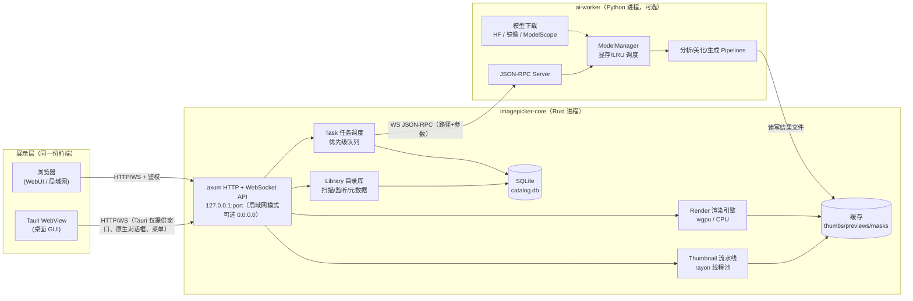
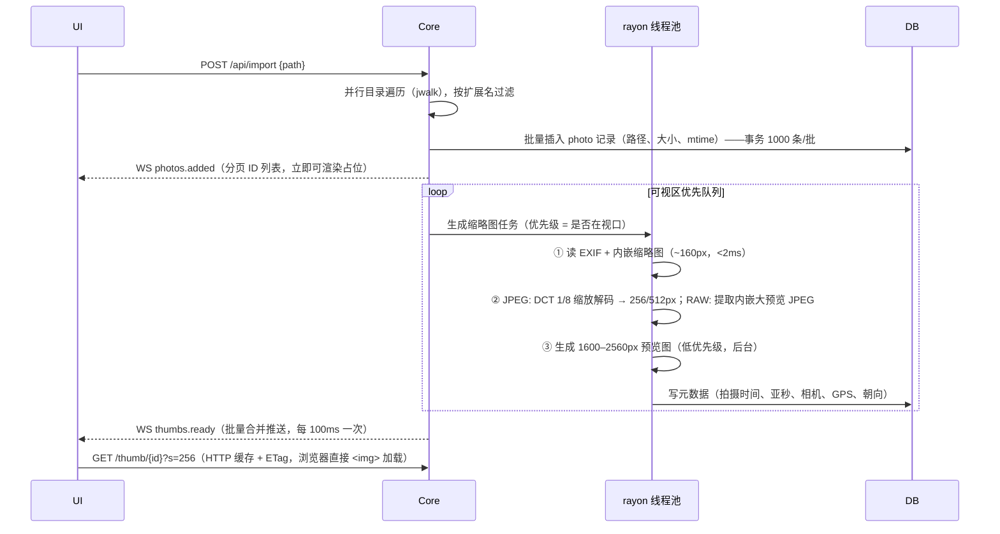
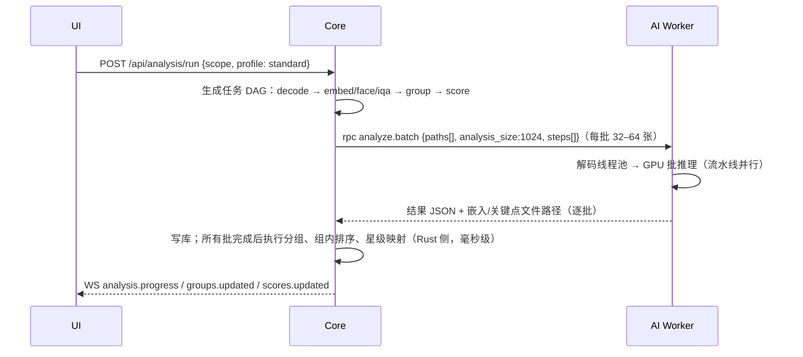
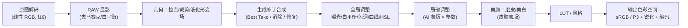

# 02 系统架构设计

## 1. 设计原则

1. **本地优先、隐私第一**：默认零联网；原图只读；所有派生数据（缩略图、分析结果、编辑栈）存放在应用缓存与目录库中。
2. **快是第一功能**：IO/解码/缩略图走 Rust 原生多线程；AI 推理走独立进程批处理；前端只做展示，永不阻塞。
3. **一套前端，两种形态**：桌面 GUI（Tauri）与 WebUI（浏览器）共用同一份前端与同一套 HTTP/WebSocket API。
4. **非破坏性**：所有编辑是参数化编辑栈 + 派生图层（蒙版、形变场、生成补丁），渲染引擎确定性地合成。
5. **AI 可插拔、硬件自适应**：模型通过注册表声明能力、档位、显存；调度器根据硬件选择实现并管理显存。
6. **AI 建议，人来决定**：AI 结果与用户决定分开存储，所有自动操作可预览、可撤销。

## 2. 技术栈总览

| 层 | 选型 | 理由 |
|---|---|---|
| 桌面壳 | **Tauri 2** | 体积小（~10MB）、跨平台（WebView2 / WKWebView / WebKitGTK）、Rust 原生能力、自带打包与自动更新 |
| 核心服务 | **Rust**：tokio + axum + rayon | 高性能并发 IO、解码、缩略图、渲染；同时作为 WebUI 服务器 |
| 图像解码 | **纯 Rust 优先**：`jpeg-decoder` / `zune-jpeg`（DCT 域 1/2、1/4、1/8 缩放解码）、`image`、RAW 内嵌预览自研解析（TIFF IFD / CR3 BMFF / RAF）、`rawler`（RAW 全解码，P1）、`fast_image_resize`（SIMD）。**HEIF/AVIF** 不打包 HEVC 解码器：文件内 JPEG → 系统解码器（Windows WIC 需 HEIF + HEVC 扩展、macOS ImageIO）→ 运行时加载 libheif（Linux 系统库或 AI 组件自带），缺失时报出缺什么（见 [5.1](#51-导入与缩略图极速路径)）。libjpeg-turbo 作为后续可选加速 | 不依赖 cmake/nasm，三平台零配置构建；系统解码器自带硬件加速与专利授权 |
| 元数据 | `nom-exif` / `kamadak-exif`（读）、XMP 读写（自研轻量 XML） | EXIF 时间、亚秒、GPS、相机参数 |
| 渲染引擎 | **wgpu**（WGSL compute shader）+ CPU 兜底（rayon） | 一套着色器覆盖 Vulkan / Metal / DX12；预览与导出同源，结果一致 |
| 数据库 | **SQLite**（WAL）+ `rusqlite`；向量用 `sqlite-vec` 或内存索引 | 单文件、零运维、可靠 |
| 前端 | **React 19 + TypeScript + Vite**；TanStack Query / Virtual / Router；Zustand；Tailwind CSS + Radix(shadcn/ui)；i18next | 生态成熟、虚拟列表、类型安全 |
| 图像查看 | 自研 Canvas/WebGL2 查看器（瓦片金字塔、同步缩放） | 大图流畅、2/4-up 同步 |
| AI Worker | **Python 3.12**（`uv` 管理，python-build-standalone 内嵌）；**ONNX Runtime** 为主（CUDA / TensorRT / CoreML / DirectML / ROCm / CPU EP），**PyTorch** 用于重模型（VLM、扩散）；OpenCV、MediaPipe、`huggingface_hub` | AI 生态最全；ONNX 让轻模型跨平台；重模型按需安装 |
| 进程通信 | Core ⇄ Worker：WebSocket JSON-RPC（localhost + 随机 token）；大数据走共享缓存文件路径 | 简单、可调试、语言无关 |
| 打包 | Windows：NSIS/MSI；macOS：DMG（arm64 + x64）；Linux：AppImage + **AUR PKGBUILD**（CachyOS）+ Flatpak（P2）；Android：APK（Tauri 2 移动端） | 覆盖四平台 |
| 端侧推理 | `ip-infer` crate：Rust `ort`（ONNX Runtime），Android 必需，桌面可选 | Android 无法运行 Python Worker，详见 [08](08-Android版本设计.md) |

## 3. 进程模型



**要点**

- **前端永远只说 HTTP/WS**。桌面模式下 Tauri 启动 core（同进程内嵌，作为 Tauri 的 Rust 后端运行 axum），WebView 访问 `http://127.0.0.1:<随机端口>`；WebUI 模式下 core 以无头服务运行（`imagepicker serve --lan`），浏览器直接访问。前端仅通过一个 `platform` 适配层调用少量 Tauri 专属能力（原生文件夹选择、系统菜单、拖拽路径），WebUI 下降级为服务端目录浏览器。
- **AI Worker 是可选的独立进程**：没有安装 AI 组件时，浏览、筛选、手动修图全部可用；core 内置的「经典算法」（pHash、拉普拉斯清晰度、直方图曝光）可提供基础分组与评分。
- **Worker 崩溃隔离**：OOM / CUDA 错误只会让 Worker 重启，任务自动重试（降档重试），UI 不受影响。
- 大数据不走 IPC：Core 把分析分辨率图（如 1024px）写入缓存或直接传原图路径，Worker 自己解码；结果（嵌入向量、蒙版 PNG、关键点 JSON）写入缓存目录，RPC 只回传路径与小型 JSON。

## 4. 模块划分（代码仓库结构）

```
imagePicker/
├─ apps/
│  ├─ desktop/                 # Tauri 2 应用（src-tauri/ + 引用 web/ 构建产物）
│  └─ android/                 # Tauri 2 Android 目标 + Kotlin 插件（MediaStore/前台服务/MediaPipe）
├─ crates/
│  ├─ ip-core/                 # 领域模型、目录库、SQLite 访问、任务调度
│  ├─ ip-imaging/              # 解码（jpeg/heif/raw）、EXIF/XMP、缩略图、哈希
│  ├─ ip-render/               # 编辑栈 → 渲染图（wgpu + CPU 兜底）、色彩管理
│  ├─ ip-server/               # axum API、WebSocket 事件、鉴权、静态资源
│  ├─ ip-worker-client/        # 与 Python Worker 的 RPC 客户端、进程管理（本地或远程主机）
│  ├─ ip-infer/                # Rust ONNX Runtime 端侧推理（Android 必需，桌面轻模型可选）
│  └─ ip-cli/                  # 命令行：serve / analyze / export / bench
├─ web/                        # React 前端（Vite）
│  ├─ src/app  src/features/{library,cull,compare,besttake,edit,people,export,assistant,settings}
│  ├─ src/viewer               # WebGL 大图查看器
│  └─ src/api                  # 由 OpenAPI 生成的类型安全客户端
├─ ai-worker/                  # Python（uv 项目）
│  ├─ imagepicker_ai/
│  │  ├─ server.py             # JSON-RPC
│  │  ├─ models/               # registry.yaml + 各模型封装（统一接口）
│  │  ├─ pipelines/            # analyze / faces / besttake / beauty / color / inpaint / assistant
│  │  └─ hw.py                 # 硬件探测、档位
│  └─ pyproject.toml           # extras: [cpu] [cuda] [rocm] [mps] [pro]
├─ shaders/                    # WGSL 着色器（渲染引擎共享）
├─ bench/                      # 性能基准与评测集脚本
└─ docs/
```

## 5. 关键数据流

### 5.1 导入与缩略图（极速路径）



性能手段汇总：

| 手段 | 收益 |
|---|---|
| 优先提取 EXIF/RAW 内嵌预览 | RAW 不解码即可显示，提速 20–50× |
| libjpeg-turbo DCT 缩放解码（scale 1/8） | 24MP JPEG 解码从 ~100ms 降到 ~10ms |
| SIMD 缩放（fast_image_resize） | 缩放开销可忽略 |
| 视口优先级队列 + 滚动时取消离屏任务 | 用户永远先看到正在看的 |
| 缩略图以 JPEG 存盘（解码最快、WebView 通用），key = 快速指纹 | 二次打开秒开 |
| 缩略图通过 HTTP URL 加载（非 base64 IPC） | 浏览器并行加载、自带缓存与解码线程 |
| WS 事件合并推送（100ms 批） | 避免前端重渲染风暴 |
| Loupe 预读前后各 3 张预览图 | 翻页 < 50ms |
| SQLite WAL + 批量事务 | 万条插入 < 200ms |

**指纹（缓存 key）**：`fast_key = hash(path, size, mtime)` 用于命中缓存；`content_key = blake3(前 64KB + 后 64KB + size)` 用于检测移动/重命名后复用分析结果。

#### HEIF/HEIC 解码（分层降级）

手机照片（iPhone、多数安卓）默认是 HEIC：HEVC 编码，iPhone 为 512px 网格分块加一张 HEVC 编码的 `thmb` 缩略图，没有 JPEG 预览。没有成熟的纯 Rust HEVC 解码器；打包 libheif + libde265 既要 C/C++ 工具链（CI、Android NDK 交叉编译），又等于随应用分发 HEVC 解码器（专利授权）。因此 `ip-imaging`（`imp/heif.rs`）逐层尝试，前一层失败才进入下一层：

| 层 | 像素来源 | 平台 | 说明 |
|---|---|---|---|
| ① | 文件内 JPEG：JPEG 编码的主图；（仅缩略图）尺寸够大的 JPEG 缩略图项或 EXIF IFD1 缩略图 | 全部（含 Android） | 纯 Rust、零依赖；部分相机 / 安卓 HEIF 有，iPhone 没有 |
| ② | 系统解码器：Windows WIC（商店「HEIF 图像扩展」+「HEVC 视频扩展」）、macOS ImageIO | Windows、macOS | 授权与硬件加速由系统负责；扩展缺失时错误信息写明要装什么 |
| ③ | 运行时加载 libheif（`libloading`，不链接）：`IMAGEPICKER_LIBHEIF` → 系统 `libheif.so.1`（Linux）→ AI 组件中 pillow-heif 自带的 libheif | 桌面 | 构建零 C 依赖；Windows 从 `<数据目录>/libheif/` 的私有副本加载，避免 DLL 锁住 AI 组件目录；缩略图优先解码 `thmb` 项（iPhone 约 320px，比 12MP 主图快一个数量级） |
| ④ | （仅缩略图）更小的内嵌 JPEG | 全部 | 宁可模糊也不空白；分析 / 渲染 / 导出不用它 |

全部失败时缩略图请求返回错误，信息逐层写明原因（如「the Windows HEIF codec failed to initialise …; libheif not found …」），`thumb_state` 保持 0，装好解码器后再浏览即按需补齐。AVIF 走同一路径（WIC 需「AV1 视频扩展」、ImageIO 需 macOS 13+、libheif 需 AV1 插件；pillow-heif 自带的 libheif 不含 AV1 解码）。

方向：HEIF 的 `irot` / `imir` 是规范性的，EXIF Orientation 只是参考（改写像素的工具常留下旧值），`read_metadata` 把主图的 `irot` / `imir` 换算成 EXIF 方向值（`imir` 轴向与 libheif 一致，已用 pillow-heif 写出的 8 种方向逐一核对）；各层一律输出存储方向的像素（libheif 设 `ignore_transformations`），由统一的方向处理旋转；系统解码器若已自行旋转（输出长边换了轴）则不再重复旋转。

未采用：打包 libheif（`libheif-rs` 内置编译，见上）；把 HEIC 交给 Python Worker 的 pillow-heif 解码（要启动 Worker、走 RPC，缩略图线程是同步的，远程 AI 主机模式下还得把 HEIC 原图传出本机）——同一个 libheif 已由第 ③ 层在进程内直接使用。Android 端 Rust 只有第 ①、④ 层，系统 `ImageDecoder` 需经媒体插件接入（待办）。

### 5.2 一键分析



- **增量**：每张照片记录 `analysis_version` 与各步骤完成标志，模型或算法升级只重算受影响步骤。
- **可暂停/恢复**：任务状态持久化在 `task` 表。
- **前台优先**：用户打开某组时，该组的分析任务插队。

### 5.3 修图渲染



- **AI 负责产出"参数与图层"**（蒙版、关键点、形变场、补丁图），**渲染引擎负责确定性合成**。这样编辑栈可重放、可调参、可批量同步，导出与预览一致。
- 预览：在**代理分辨率**（长边 ≈ 屏幕分辨率，2–4MP）上用 wgpu 渲染，结果作为二进制帧经 HTTP 返回（或 WS 二进制消息），目标 < 50ms；拖动滑块期间降级到 1MP 代理，松手后高清刷新。
- 导出：同一 shader 在全分辨率上分块（tile）渲染，避免显存溢出。
- 处理色彩空间：内部线性 Rec.2020 / f16；输入 ICC 识别（sRGB、Display P3、Adobe RGB）；输出 sRGB / P3 并嵌入 ICC。
- 显示色彩：缩略图与预览统一转换为 sRGB 并嵌入 ICC（广色域原图显示「P3」角标）。WebView2 与 WKWebView 会按显示器配置文件做色彩管理；Linux WebKitGTK 不做，设置中提示「Linux 下预览未做显示器色彩管理」。

## 6. 硬件抽象与推理后端

| 平台 | GPU | ONNX Runtime EP | PyTorch | 渲染（wgpu） |
|---|---|---|---|---|
| Windows + NVIDIA | RTX 4090 等 | CUDA / TensorRT | CUDA | DX12 / Vulkan |
| Windows + AMD/Intel | — | DirectML | CPU（或 DirectML 实验） | DX12 |
| CachyOS + NVIDIA | — | CUDA / TensorRT | CUDA | Vulkan |
| CachyOS + AMD | — | ROCm / MIGraphX | ROCm | Vulkan |
| macOS Apple Silicon | 统一内存 | CoreML | MPS | Metal |
| 无 GPU | — | CPU（int8 量化模型） | CPU | CPU 兜底 / 集显 |

AI 组件安装：首次需要 AI 时，按检测到的平台安装对应 extras（`uv sync --extra cuda` 等）到应用数据目录；轻量档（CPU/ONNX）约 300–500MB，PyTorch CUDA 档约 3GB（含 CUDA 运行时），模型单独下载。详见 [03 AI 与算法设计](03-AI与算法设计.md#8-硬件分级与模型调度)。

## 7. 存储布局

```
<AppData>/imagePicker/                 # Win: %APPDATA%  mac: ~/Library/Application Support  Linux: ~/.local/share
├─ catalog.db                          # 主目录库（SQLite WAL）
├─ cache/
│  ├─ thumbs/ab/cd/<fast_key>_256.jpg
│  ├─ previews/…_2048.jpg
│  ├─ analysis/<content_key>/           # embeddings.npy, faces.json, masks/*.png, flow/*.bin
│  └─ render/                           # 代理渲染缓存
├─ edits/<photo_id>/                   # 生成补丁、手绘蒙版等编辑资产
├─ models/                             # HF 下载的模型（可指定到大容量盘）
├─ runtime/python/                     # 内嵌 Python + venv
├─ libheif/                            # Windows：AI 组件中 libheif 的私有副本（HEIC 解码，见 5.1）
└─ logs/
```

可选「便携模式」：在照片文件夹内生成 `.imagepicker/` 存放该文件夹的分析与编辑，便于移动硬盘跨电脑使用。

## 8. 安全与隐私

- 服务默认仅监听 `127.0.0.1`，随机端口 + 启动时生成会话 token（桌面 WebView 自动携带）。
- 局域网模式：显式开启，设置密码（Argon2 哈希），HTTPS 自签证书可选，可设只读访客。
- 文件访问白名单：API 只能访问已添加到库中的根目录，防止路径穿越。
- 联网行为：模型下载、更新检查、云端 API 均需用户确认，并在设置中可完全关闭。
- 原图只读：写操作仅限 XMP 侧车（可关闭）、导出目录、用户显式确认的移动/回收站操作。
- **人脸数据属于生物特征信息**（《个人信息保护法》敏感个人信息、GDPR 特殊类别数据）：仅存本机目录库；首次启用人脸识别时说明用途并征得同意；可整体关闭；可一键清除全部人脸特征与人物库；局域网模式下访客默认不可见人物页；导出与诊断包均不包含人脸特征。
- 目录库备份：每日自动备份 `catalog.db`（`VACUUM INTO`，保留 7 份），启动时 `PRAGMA quick_check`，失败时引导从备份恢复。

## 9. 可观测性与质量

- 结构化日志（`tracing` / Python `structlog`），按模块分级；「导出诊断包」一键打包日志 + 硬件信息（不含照片）。
- 内置基准：`imagepicker bench --thumbs --analysis --render` 输出各阶段吞吐，用于回归。
- 前端性能监控：长任务、帧率、内存（开发模式面板）。

## 10. 关键技术决策（ADR 摘要）

| # | 决策 | 备选方案 | 理由 / 代价 |
|---|---|---|---|
| ADR-1 | 桌面壳用 **Tauri 2** | Electron；Qt/PySide6；Flutter | 体积与内存远小于 Electron；Web 前端可复用为 WebUI（Qt 做不到）；代价：Linux WebKitGTK 性能/特性略弱 → 大图查看用 WebGL2（三平台均支持），不依赖 WebGPU |
| ADR-2 | 核心服务用 **Rust** | 全 Python（FastAPI） | 缩略图/渲染/并发 IO 性能、单二进制分发；代价：三种语言（Rust/TS/Python）维护成本 |
| ADR-3 | AI 用**独立 Python 进程** | Rust 内用 `ort` 直接推理 | Python 生态（diffusers、transformers、mediapipe、pyiqa）开发速度远快；进程隔离防崩溃。后续可把高频轻模型（嵌入、人脸检测）迁到 Rust `ort` 以去掉对 Python 的硬依赖（P2 优化项） |
| ADR-4 | 前端**统一走 HTTP/WS**，不用 Tauri IPC 做业务 | Tauri invoke | 桌面与 WebUI 一套代码；图片走 HTTP 可利用浏览器缓存与并行解码 |
| ADR-5 | **AI 产出参数/图层，渲染引擎确定性合成** | AI 直接输出成品图 | 非破坏、可调参、可批量同步、预览导出一致；生成式结果作为"补丁图层"纳入同一体系 |
| ADR-6 | 渲染用 **wgpu + WGSL** | 前端 WebGL 预览 + 后端 OpenCV 导出 | 一套 shader 保证预览=导出；WebUI 远程访问时也由服务端 GPU 渲染 |
| ADR-7 | 数据库 **SQLite** | Postgres；纯 JSON 文件 | 零运维、事务、单文件可备份 |
| ADR-8 | ONNX 优先、PyTorch 按需 | 全 PyTorch | ONNX Runtime 跨 CUDA/CoreML/DirectML/ROCm/CPU，安装体积小；扩散/VLM 等 ONNX 生态不成熟的用 PyTorch |
| ADR-9 | Android 复用 **Tauri 2 移动端** + Rust 端侧推理 | Flutter / 原生 Kotlin 重写 | 复用前端与核心 70%+ 代码；重计算走远程 Worker；代价：Tauri 移动插件生态较新，需自写 Kotlin 插件 |
| ADR-10 | HEIF/HEIC：文件内 JPEG → 系统解码器 → 运行时加载 libheif，**不打包 HEVC 解码器** | 打包 libheif/libde265；交给 Python Worker 解码 | 构建零 C 依赖、不分发专利编解码器、进程内解码；代价：Windows 缺 HEVC 扩展且未装 AI 组件、Linux 未装 libheif 时 HEIC 没有缩略图（错误信息提示安装） |
