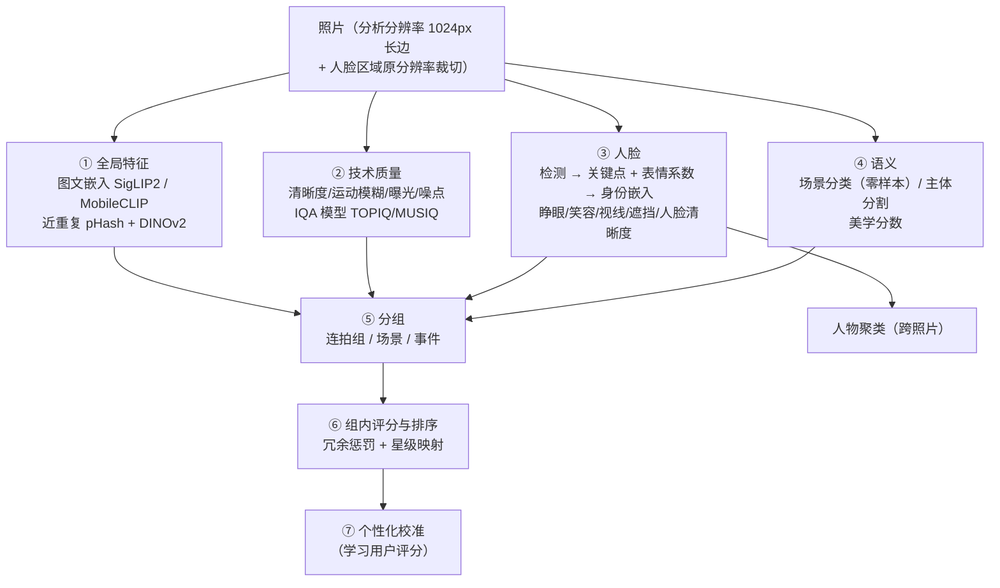
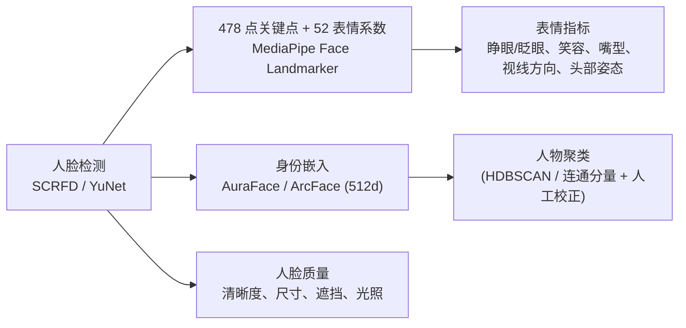
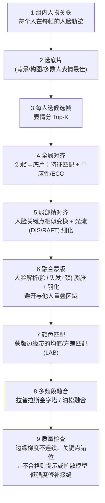

# 03 AI 与算法设计

> 本文描述每个智能功能的算法流程、所用模型（候选，详见 [07 模型清单](07-模型清单与许可.md)）、低端硬件下的替代算法，以及显存调度策略。
> 原则：**每个功能都有「经典算法兜底」**，GPU 越强效果越好，但没有 GPU 也能用。

## 1. 分析流水线总览



### 分析档位

| 档位 | 包含步骤 | 4090 吞吐（估） | CPU 吞吐（估） |
|---|---|---|---|
| 快速 | pHash、经典清晰度/曝光、轻量人脸检测 + 眨眼、MobileCLIP 嵌入 | ~60 张/s | ~5 张/s |
| 标准（默认） | + SigLIP2 嵌入、TOPIQ/美学、人脸身份嵌入、MediaPipe 表情系数、场景分类、主体分割 | ~15–25 张/s | ~1 张/s |
| 深度 | + VLM 评审（Q-Align 或 Qwen-VL 给出质量/美学评分与文字理由）、姿态估计 | ~2–4 张/s（仅对每组 Top-5 运行） | 不建议 |

> 深度档采用**级联**策略：先用标准档排序，再只对每组候选前 5 名跑昂贵的 VLM，成本可控。

## 2. 智能分组（连拍 / 场景 / 事件）

### 2.1 时间线构建

1. 拍摄时间 = `DateTimeOriginal + SubSecTimeOriginal + OffsetTime`；缺失时降级到文件名中的时间戳（如 `IMG_20251001_123456`）→ 文件 mtime。
2. **RAW+JPEG 配对**视为一个拍摄单元：分组、评分、人脸只计算一次（用 JPEG 或 RAW 内嵌预览），评分与旗标同步到配对双方。
3. **多设备时间对齐**（F2.11）：按相机型号/序列号把照片分成"设备流"。对两条设备流，在候选偏移 Δt ∈ [−12h, +12h] 内搜索，使"视觉嵌入高度相似（cos > 0.9）的跨设备照片对的时间差"最集中（直方图峰值），得到偏移估计；置信度低时提示用户手动指定（UI 中拖动时间轴对齐）。

### 2.2 三级分组算法

```
输入：按时间排序的照片序列 p1..pn，嵌入 e_i（L2 归一化），pHash h_i

连拍组（Burst）—— 顺序分割：
  对相邻 (p_i, p_{i+1})：
    Δt = t_{i+1} - t_i
    sim = 0.6·cos(e_i, e_{i+1}) + 0.4·(1 - hamming(h_i,h_{i+1})/64)
    若 Δt ≤ T_burst(=自适应, 默认 3s) 且 sim ≥ θ_burst(0.85) → 同组
    若 Δt ≤ 30s 且 sim ≥ θ_strict(0.92)               → 同组（慢速连拍/同一构图多次按快门）
    否则 → 新组
  组内再检查：与组首张相似度 < 0.75 时切开（防止长组漂移）

场景（Scene）—— 对连拍组代表嵌入做时间约束聚类：
  相邻连拍组若 Δt ≤ 10min 且代表嵌入 cos ≥ 0.7 → 合并为同一场景
  （可选：HDBSCAN 处理"回到同一地点再拍"的非连续情况）

事件（Event）—— 时间间隔 > 2h 或 GPS 距离 > 5km 切分；
  事件命名：日期 + 反向地理编码（离线 GeoNames 数据集）+ VLM 生成短标题（可选）
```

- 阈值 `T_burst` 自适应：统计该设备流相邻间隔的分布，取低谷点（连拍间隔通常 < 1s，普通拍摄间隔 > 5s）。
- 顺序分割的两点补充（阈值不变）：① **回看**：新照片与前 8 张中满足上述规则且最相似的一张同组，而不只看前一张——单张异常帧（眨眼、转头、运动模糊）不再把连拍切成两段，两台相机同时拍摄时交错的照片也各归各组；② **补洞**：夹在同一连拍组中间、由同一相机按连拍节奏（每步 Δt ≤ T_burst）拍下的 ≤ 2 张照片并入该组（连拍中途同一相机拍不出无关照片），相机未知时不补。
- 所有阈值在设置中以「分组松紧度」滑块暴露（松/中/紧），并支持手动拆分/合并组（拖拽），手动操作优先级最高。
- 评测：在标注集上计算 Pairwise F1，目标 ≥ 0.9。

## 3. 质量评分系统

### 3.1 分项指标

| 维度 | 指标 | 算法（标准档） | 经典兜底（T0） |
|---|---|---|---|
| 清晰度 | 主体区域清晰度 | 主体/人脸区域的拉普拉斯方差 + Tenengrad，按焦距/分辨率归一化；运动模糊方向性检测（梯度方向谱） | 同左 |
| 对焦 | 是否跑焦 | 人脸/主体清晰度 vs 背景清晰度之比；人眼区域高频能量 | 同左 |
| 曝光 | 过曝/欠曝/动态范围 | 亮度直方图、高光溢出比例（主体区域加权）、EXIF 曝光参数 | 同左 |
| 噪点 | 噪声估计 | 平坦区域高频残差（MAD 估计），结合 ISO | 同左 |
| 综合技术质量 | 无参考 IQA | TOPIQ-NR / MUSIQ / CLIP-IQA（pyiqa） | 以上加权 |
| 美学 | 构图/色彩/氛围 | LAION Aesthetic（CLIP/SigLIP 头）、TOPIQ-IAA；深度档：Q-Align / VLM | 三分法/水平/主体占比启发式 |
| 人脸 | 睁眼、笑容、视线、头部姿态、遮挡、人脸清晰度 | 见 §4 | YuNet + EAR 眨眼 |
| 构图 | 水平倾斜、主体被裁切、主体位置 | 霍夫直线/消失线估计倾斜；主体框是否贴边 | 同左 |
| 干扰 | 路人、手指遮挡、杂物 | 非主体人物检测（面积/位置/对焦判断）；镜头边缘手指（肤色+模糊+边缘位置分类器） | 部分 |

### 3.1.1 倾斜检测（水平校验）

> 实现：`crates/ip-lite/src/tilt.rs`（lite）与 `ai-worker/imagepicker_ai/steps/tilt.py`（fast / standard），同一算法与常量，属于 `quality` 步骤；`crates/ip-lite/tests/parity.rs` 交叉校验（角度差 ≤ 0.01°）。结果存 `analysis.tilt_deg`（度，**顺时针为正**：地平线右低；把照片逆时针转该角度即放平）与 `analysis.tilt_confidence`（0–1）。

在分析尺寸灰度图（长边 ~1024，与清晰度同一张）上做**方向门控、只看近轴的霍夫变换**：

1. 高斯 σ=1 + Sobel；幅值 > 20 的像素按方向分「近水平」H 族与「近竖直」V 族（偏离坐标轴 ≤ 15° + 2°），沿梯度方向做非极大值抑制细化成单像素边；权重随幅值 20→60 线性升到 1。
2. 每个边缘像素只给与自身梯度方向相差 < 2° 的候选角 θ（±15°，0.25° 一档，三角权重）投票，投到该角下的直线偏移 ρ（1 px 一档，线性分摊）；H、V 各一张累加器。
3. 每个 θ 只取 ρ 的局部峰（3 档窗口）且只计共线长度 ≥ 长边 4% 的线（软阈值到 8%），得到角度谱 P_H(θ)、P_V(θ)。树叶、发丝、波纹、织物等短纹理边不会在同一 ρ 上累积。
4. 倾角 = P_H + P_V 主峰 ±0.75° 内上半部分的质心（亚档精度）。
5. 置信度 = 支持度 `1 − e^(−峰值线长 / 0.5·长边)` × 主导度 `1 − 次峰/主峰`（次峰取距主峰 > 1° 的最大值）× 族一致性（某一族自己的主峰在别处时按其强度惩罚：仰拍会聚的竖线 vs 水平地平线、斜放桌沿 vs 竖直门框）。

取舍：单纯的梯度方向直方图会被纹理与透视线带偏，共线峰把证据限定在真正的长直线上，角度精度来自共线性（合成直线误差 < 0.1°）；竖线在相机不俯仰时与水平无关地保持竖直，横线却随透视偏转，所以两族分开统计、互相校验。没有直线的照片（纯色背景人像、美食特写、森林）置信度 ≈ 0，不判定。

**判定**（`scoring.rs` `TILTED_*`）：置信度 ≥ 0.2 且 2° ≤ |倾角| ≤ 10° 标 `tilted`，理由带角度（`{"deg": 3.5}`）。更大的角度多为透视或刻意构图，不标。只是标签：不扣分、不影响星级（倾斜在修图里一键拉直即可，且误判风险高于其他问题）。

**标定**（lite 档实测，`bench/make-tilt-set.py` 把图库 247 张照片——全部风景 + 部分静物/人像/合影——按 0、±1、±2、±3、±5、±8° 旋转并裁掉黑边，共 2717 张；`bench/eval-tilt.py`）：

| 置信度 ≥ | 2° 起判：精确率（真值 \|角\| ≥ 2°） | 召回 \|角\| ≥ 3°（有直线的照片） | 0° 副本误报 | 原图库误报 |
|---|---|---|---|---|
| 0.15 | 0.90 | 0.19（0.29） | 4.5% | 3.3% |
| **0.2** | **0.91** | **0.14（0.21）** | **3.2%** | **2.4%** |
| 0.3 | 0.87 | 0.07（0.12） | 2.4% | 1.1% |

- 置信度 ≥ 0.2 的估计相对同一照片 0° 估计的误差：MAE 0.08°（中位 0.05°，无 > 1°）；按「原图水平」算绝对误差 MAE 1.3°（中位 0.46°）——生成图本身并不都水平（如 `pl09-noon` 海平线约 2.5°），0° 误报与绝对误差里有一部分是真倾斜。
- 召回偏低是有意的：多数照片缺少能定水平的长直线或被透视线干扰，宁可不标。提示词要求「倾斜约 8°」的三张港口图估计为 10–12°，但桅杆方向杂乱、置信度 < 0.05，未标。
- 其他问题标签与星级在原图库上不变（`bench/eval-library.py`）。

### 3.2 综合分与星级映射

```
场景类型 c ∈ {人像, 合影, 风景, 美食, 建筑, 夜景, 宠物, 其他}（SigLIP 零样本分类）
Q = Σ_k w_k(c) · s_k        // 各分项归一化到 0–1，权重随场景类型变化
   − 硬性惩罚（主体人物闭眼 −0.25；严重模糊 −0.3；严重过曝 −0.2 …）
冗余调整：组内与更高分照片高度相似且无独特优点 → 轻度降分（使"每组最佳"更突出）

星级 = 绝对分 + 组内相对排名 的结合：
  base_star = 分段映射(Q)：<0.2→0, <0.35→1, <0.5→2, <0.65→3, <0.8→4, ≥0.8→5
  组内第 1 名 +0.5（取整后不超过 5）；有硬性问题者上限 2 星
```

| 场景 | 主要权重 |
|---|---|
| 人像/合影 | 人脸（0.4）、清晰度（0.25）、美学（0.2）、曝光（0.15） |
| 风景/建筑 | 美学（0.4）、技术质量（0.3）、构图（0.2）、曝光（0.1） |
| 夜景 | 降低噪点惩罚、提高清晰度权重 |

- **可解释**：每个分项及其贡献都存库，UI 以条形图展示，并生成一句话理由（模板化；深度档由 VLM 生成）。
- **AI 星级永不覆盖用户星级**。

### 3.3 个性化评分（F2.10）

- 训练数据：用户的显式评分、精选/淘汰、组内选择（隐式成对偏好：选中 A 未选 B ⇒ A ≻ B）。
- 模型：在 [SigLIP 嵌入 ⊕ 分项分数 ⊕ 场景 one-hot] 上训练**成对排序的线性/小 MLP 头**（RankNet / 逻辑回归），CPU 秒级训练；每积累 50 个新标注自动增量重训。
- 输出与基础分融合：`Q' = (1−α)Q + α·Q_user`，α 随标注量从 0 增至 0.6；在保留集上若个性化未提升则自动回退。
- 可在设置中查看「我的口味」：例如"你偏好低饱和、更喜欢抓拍而非摆拍"。

## 4. 人脸与表情分析



### 4.1 表情指标

| 指标 | 计算 | 备注 |
|---|---|---|
| 睁眼度 | 表情系数 `eyeBlinkLeft/Right`；辅以 EAR（眼睛纵横比） | 双眼都 > 0.55 判闭眼；半眯眼单独标签 |
| 笑容 | `mouthSmileLeft/Right`、`cheekSquint` | 区分"自然笑/大笑/不笑"；可选 FER 表情分类模型 |
| 视线 | 虹膜关键点相对眼眶位置 + 头部姿态 | "看镜头"得分 |
| 头部姿态 | 关键点 PnP 求 yaw/pitch/roll | 侧脸过大降分 |
| 嘴型 | `jawOpen`、`mouthFunnel` | 说话中/尴尬嘴型识别 |
| 遮挡 | 关键点置信度 + 人脸分割可见比例 | 被手、头发、他人遮挡 |
| 人脸清晰度 | 眼部区域高频能量 | 跑焦/运动模糊 |

**表情分 = f(睁眼, 笑容自然度, 视线, 姿态, 清晰度)**，权重可随用户偏好学习（有人喜欢抓拍不看镜头）。

### 4.2 主体人物判定

合影中并非所有人脸同等重要：主体权重 = 人脸面积 × 居中度 × 清晰度 × 是否为"已命名人物" × 是否看镜头。路人（小、虚、靠边、背向）权重低，且可被标为「路人」用于消除功能。

### 4.3 人物聚类

- 512 维身份嵌入，余弦相似度；先在连拍组内用 IoU + 相似度做轨迹关联（同一人同一组必然同一身份），再跨组聚类（HDBSCAN，min_cluster_size=3）。
- 用户命名/合并/拆分作为约束（must-link / cannot-link），后续新照片按最近人物中心分配。
- 人物库跨会话保留（可删除，隐私）。

### 4.4 按人脸筛选（F2.13）

所有人脸筛选都基于 `face` 表的逐脸记录（person_id、表情指标、is_subject），在 SQL 中完成，万张库 < 100ms：

| 筛选 | 实现 |
|---|---|
| 多人 AND / OR / NOT | `photo.id IN (SELECT photo_id FROM face WHERE person_id IN (...) GROUP BY photo_id HAVING COUNT(DISTINCT person_id) = k)`；OR 去掉 HAVING；NOT 用 `NOT EXISTS` |
| 按人状态 | 子查询中附加 `eyes_open ≥ 0.55`、`smile ≥ 0.5`、`gaze ≥ 0.6`、`is_subject = 1`、`sharpness ≥ τ`（阈值与表情分析一致，设置中可调） |
| 点脸即筛 | 已聚类的脸直接用其 person_id；尚未聚类/孤立的脸用其嵌入做近邻检索（cos ≥ 阈值，在评测集上校准）得到「临时人物」 |
| 以脸搜脸 | 上传图 → 人脸检测（多张脸让用户点选）→ 嵌入 → 与各人物中心及孤立人脸近邻检索 → 返回候选人物（附相似度）供确认 |
| 人数 | 分析阶段回填 `photo.subject_face_count`（只计 is_subject）与 `photo.face_count` |
| 每人最佳 | 对人物 p 的每张照片：`best = 0.6·该人 expression_score + 0.4·照片综合分 Q`，同一连拍组只取最高一张，取 Top-N |

默认人物筛选只匹配**主体**人脸（§4.2），可切换为「包括作为背景路人出现」。

## 5. 最佳表情合成（Best Take）

目标：同一连拍组中，以一张为底片，为每个人选择最佳帧中的脸，合成"全员最佳"。



- **选底片**（第 2 步，`generate.rs` `plan_from_tracks`）：逐帧估算以它为底片时「全员最佳」要做的合成工作与残留风险，不再总用组内最佳：
  - 「足够好」= 表情分距本人组内最佳不超过 0.04（`MIN_GAIN`）；只有可合成（姿态差 ≤ 25°）且比底片原脸高出 0.04 以上的脸才替换（一键全员最佳与选底片用同一规则）。
  - 代价 = Σ 每张需替换的脸 × 脸尺寸权重（√面积，相对最大的脸）+ 6 × 替换后仍低于本人最佳的表情差（超出 0.04 的部分，如无法替换的闭眼）× 权重 + 3 × 缺席的人物 × 权重（人物 = 在至少一半帧、且至少两帧中出现的主体）。
  - 模糊 / 过曝 / 欠曝（`photo.issues`）的帧不作底片，全部帧都有时才参与比较；闭眼、噪点、倾斜不排除（可合成或修图修复）。
  - 在剩余帧中取代价不超过「最低代价 + 0.25」的**排名最靠前**一帧：组内最佳只在别的帧明显省事时才被替代，平局按组内排名，结果确定、可复现。
  - 计划附带 `base_choice`：`mode`（auto / manual）、`reason`（`group_best`、`group_best_issue`、`fewer_missing`、`fewer_replacements`、`fewer_below_best`、`less_work`、`manual`）、`auto_photo_id` 与每帧的 `replacements` / `below_best` / `missing` / `issues` / `cost`，供界面与 CLI 解释；用户可手动指定底片（`?base_photo_id=`、`besttake/auto` 请求体）。
- 结果作为**补丁图层**（patch + mask + 源帧引用）存入编辑栈，可随时切换回原脸或换另一个候选。
- 约束：底片与源帧相机位移过大（单应性残差 > 阈值）或人物姿态变化过大（头部姿态差 > 25°）时，该候选标记「不可合成」，只提供"选这张整图"建议。
- 高端档（T3）可选：用扩散修补模型（inpainting）以低去噪强度只重绘接缝带，消除残余伪影。
- 伦理约束：只允许同一人物（身份嵌入相似度 > 阈值）在同一连拍组内替换。

## 6. 光影与色彩智能调整

### 6.1 一键自动（F5.3）

| 子任务 | 标准方案 | 经典兜底 |
|---|---|---|
| 白平衡 | 学习型 AWB（如 FC4 类模型，轻量 CNN）；人像场景以肤色为锚点校正 | 灰度世界 + 白点 + 肤色约束 |
| 曝光/色调 | 主体加权的直方图目标匹配 → 输出 曝光/高光/阴影/白/黑 参数 | 同左（规则） |
| 色彩 | 场景自适应自然饱和度；天空/植被/肤色分区处理 | HSL 规则 |
| 去雾/通透 | 暗通道先验 → 输出"去雾"参数 | 同左 |
| 低光 | Zero-DCE++（轻量）估计曲线 → 转换为曲线参数 | 自适应伽马 + CLAHE |
| 学习型风格 | Image-Adaptive 3D LUT（轻量，几 ms）预测 LUT 混合权重 | 预设 |

**关键设计：AI 输出的是"滑块参数"，而非直接改图**。用户看到的是"曝光 +0.35、阴影 +22、色温 +300K"，可继续微调；批量时每张单独预测参数，保证一致的观感而不是一刀切。

### 6.2 组内统一（F5.6）

把参考照片的调整同步到组内其他照片时：先同步参数，再以参考图渲染结果为目标，对每张做曝光/白平衡的小幅自适应匹配（主体区域亮度与灰点匹配），避免因原片曝光差异导致同步后不一致。

### 6.3 风格参考迁移（F5.7）

从参考图统计 LAB 分区色彩分布（阴影/中间调/高光），求解最接近的色彩分级参数 + 曲线（可微渲染器上梯度优化，~100 次迭代，GPU < 1s），输出仍然是可编辑参数。

### 6.4 智能蒙版（F5.4）

| 蒙版 | 模型 | 兜底 |
|---|---|---|
| 主体 / 人物 | BiRefNet（高质量抠图）；SAM 2 点选细化 | MediaPipe Selfie Segmentation |
| 天空 | 语义分割（SegFormer ADE20K 天空类） | 颜色+位置启发式 |
| 皮肤/头发/衣服 | MediaPipe 多类自拍分割（头发/身体皮肤/面部皮肤/衣服）；人脸解析（细分眉眼唇） | 肤色模型（YCbCr） |
| 指定人物 | 人体实例分割 + 人物身份关联 | — |
| 深度 | Depth Anything V2 | — |

蒙版以 8-bit PNG（分析分辨率，渲染时引导滤波上采样到原图边缘）缓存。

### 6.5 降噪 / 超分 / 修复

- 降噪：SCUNet / NAFNet（ONNX），按 ISO 自适应强度；输出作为"降噪图层"缓存。
- 超分：Real-ESRGAN x2/x4（分块推理）。
- 人脸修复：GFPGAN / CodeFormer，强度可调，只在人脸小且模糊时建议（避免"塑料脸"）。

## 7. 人像美化

所有美颜都是**蒙版 + 参数**或**形变场**，可按人物单独设置。

### 7.1 皮肤：磨皮、美白、去瑕疵

```
皮肤蒙版 M = 面部皮肤 ∪ 身体皮肤 − (眉、眼、唇、鼻孔、头发)   // 人脸解析 + 多类分割
磨皮（保纹理频率分离）：
  低频 L = 引导滤波/双边滤波(I, σ 随人脸尺寸自适应)
  高频 H = I − L
  L' = 表面模糊(L) 去除斑驳色块；H' = H · (1 − k·smooth)  并保留细纹理的一部分（毛孔）
  输出 = I·(1−M·s) + (L'+H')·(M·s)
美白/肤色：
  在 LAB 中对 M 区域：L 通道提升 + a/b 向目标肤色均值移动（去黄/去红），强度 w
  保护高光，防止过曝
去瑕疵：
  在皮肤区域检测局部亮度/色度异常小斑点（DoG blob + 分类器）→ 小块 inpainting（Telea / LaMa）
```

### 7.2 脸型：瘦脸、小脸、大眼

- 基于 478 关键点定义控制点：脸颊轮廓点向脸中线方向位移（瘦脸）、眼睛区域局部放大（大眼）、下巴点上移/收窄。
- 形变算法：**MLS（移动最小二乘）刚性形变**或局部径向液化，生成**稠密形变场**（f16 位移图），渲染引擎采样；形变场在人脸区域外平滑衰减为 0。
- 强度上限保护：位移 ≤ 人脸宽度的 6%（自然档 3%）。

### 7.3 身体：瘦手臂、瘦腿、瘦腰、长腿

```
1. 姿态估计：DWPose / RTMPose（133 点全身），得到肩、肘、腕、髋、膝、踝
2. 人体分割：BiRefNet 或实例分割，得到该人物的精确蒙版
3. 构建形变：
   - 瘦手臂/腿：以骨骼线段为中轴，对蒙版内、垂直于骨骼方向的像素向中轴收缩（收缩率 r），
     在蒙版外的过渡带内平滑衰减
   - 瘦腰：髋—肩之间腰部区域水平收缩
   - 长腿：髋部以下区域纵向拉伸（仅当腿部下方为地面/简单背景）
4. 背景保护（关键）：
   - 检测背景直线（LSD 直线检测）与重要结构；形变带若跨越直线 → 降低该处强度或改用方案 B
   - 方案 B（T2+）：人物收缩后，用人体蒙版差集得到"露出的背景空洞"，用 LaMa / 扩散修补补全背景，
     从而背景完全不变形
5. 输出：形变场 + （可选）背景补全补丁图层
```

- 自然度检查：形变后检测衣服纹理拉伸、背景直线曲率，超阈值时 UI 提示"可能不自然"。
- **按人物生效**：默认只对选中人物；儿童（可选的年龄估计）默认不启用身体形变。

### 7.4 一键美颜档案

用户可为某个已命名人物保存「美颜档案」（如：磨皮 30、美白 20、瘦脸 15），之后该人物出现在任何照片中都可一键应用（且同组照片保持一致）。

## 8. 硬件分级与模型调度

### 8.1 档位定义

| 档位 | 典型硬件 | 能力 |
|---|---|---|
| **T0 CPU** | 无独显 / 老笔记本，8GB+ 内存 | 经典算法 + int8 小模型（YuNet、MediaPipe、MobileCLIP-S0、轻量 IQA）；美颜（MediaPipe 分割 + 传统滤波）；LaMa CPU 慢速可用 |
| **T1 入门 GPU** | Apple M1/M2（统一内存 ≥ 8GB）、4–6GB 独显、Intel/AMD 集显(DirectML) | + SCRFD、AuraFace、SigLIP2-base、TOPIQ、BiRefNet-lite、LaMa、GFPGAN |
| **T2 中端 GPU** | 8–12GB（RTX 3060/4070）、M 系列 Pro/Max | + SigLIP2-large、DWPose、SAM 2、Real-ESRGAN、Depth Anything、小型 VLM（3–4B，4bit）用于 AI 助手 |
| **T3 高端 GPU** | ≥ 16GB，如 **RTX 4090 24GB** | + Q-Align / 7–8B VLM 评审与助手、扩散修补（SDXL Inpaint / FLUX Fill 量化版）、IC-Light 重打光、指令式编辑（实验） |

自动检测：Worker 启动时探测（`torch.cuda` / `nvidia-smi` / Metal / DirectML 设备、显存、内存、CPU 核数），并做 3 秒微基准，给出推荐档位；用户可覆盖。

### 8.2 显存调度（ModelManager）

```
每个模型在 registry.yaml 中声明：id, task, tier, backend(onnx/torch), precision, vram_mb, ram_mb, load_time
ModelManager：
  - 预算 = 显存总量 × 0.85 − 渲染引擎预留(1–2GB)
  - 常驻集：分析类小模型（检测/嵌入/IQA/关键点，合计 ~2–3GB）
  - 按需加载：大模型（VLM ~6–16GB、扩散 ~8–14GB）加载前按 LRU 卸载其他非常驻模型
  - 互斥组：VLM 与 扩散模型 不同时驻留（24GB 下）
  - 批大小自适应：首批探测显存，OOM 时减半重试；连续 OOM 降档到 CPU/更小模型
  - 空闲 N 分钟卸载大模型，释放显存给其他软件（游戏/剪辑）
```

4090 典型驻留：分析模型组 ~3GB + 渲染 ~1.5GB + [Qwen-VL 7B AWQ ~7GB **或** FLUX Fill NF4/FP8 ~12GB]，留足余量。

### 8.3 无高端显卡时的「智能算法助手」

当硬件不足以运行 VLM/扩散时：

1. **规则专家系统**：把摄影后期经验编码为规则（如"逆光人像：阴影+、高光−、肤色区域曝光补偿"），配合场景分类与直方图特征输出参数，效果稳定、可解释、毫秒级。
2. **经典 CV 替代**：消除用 Telea/PatchMatch 修补；美颜用 MediaPipe 分割 + 引导滤波；分组评分用 pHash + 拉普拉斯 + EAR。
3. **离线命令解析器**：AI 助手的自然语言指令在低端机上用「意图模板 + 实体抽取」（人物名、星级、场景词）解析成筛选/操作，覆盖 80% 常用指令。
4. **远程 GPU（推荐）**：家里有 4090 主机时，笔记本连接主机的 WebUI 或把主机设为「远程 AI Worker」（Worker 协议本就基于 WebSocket，可跨机器）。
5. **云端 API（可选，默认关闭）**：用户自配 API Key，明确告知会上传缩小后的图片。

## 9. AI 助手（F8）

### 9.1 架构：工具调用（Tool Use）

```
用户："把这次京都的照片里有小明的、4星以上的挑出来，统一调成胶片风"
   ↓  LLM（本地 Qwen3 / Qwen-VL；或离线解析器；或可选云端）
计划（JSON 工具调用）：
   1. filter(event="京都", person="小明", rating_gte=4)
   2. apply_preset(selection=$1, preset="胶片-暖")
   3. auto_adjust(selection=$1, mode="match_style")
   ↓  执行前在 UI 展示计划与影响范围（"将影响 23 张照片"），用户确认
执行 → 可整体撤销
```

可用工具（与 REST API 一一对应）：`search`、`filter`、`set_rating`、`set_flag`、`group_keep_top`、`apply_preset`、`auto_adjust`、`beauty`、`best_take`、`remove_people`、`export`、`describe_photo`、`suggest_edits`。

### 9.2 看图修图建议

VLM 读入预览图（+ 直方图、分项分数作为文本上下文）→ 输出结构化建议 `{"problems":[...], "adjustments":{"exposure":0.3,...}, "reason":"..."}` → 渲染预览 → （可选）再让 VLM 比较前后图做一次自我校验迭代（最多 2 轮）。

## 10. 评测体系

| 能力 | 数据 | 指标 |
|---|---|---|
| 分组 | 自建标注集：5 次旅行/聚会共 ~3000 张，人工标注连拍组 | Pairwise Precision/Recall/F1 |
| 组内最佳 | 同上，标注每组用户首选 | Top-1 / Top-3 命中率 |
| 闭眼检测 | 自建 1000 张人脸裁切 + 公开 CEW 数据集 | Recall / FPR |
| 质量评分 | KonIQ-10k、SPAQ（技术）、AVA（美学）抽样 | SRCC / PLCC |
| 人物聚类 | 自建家庭相册 + LFW 抽样 | BCubed F1 |
| Best Take | 50 组人工评审 | 自然度 MOS（1–5），伪影率 |
| 美颜 | 30 张人像人工盲评 | 自然度 / 喜好度 MOS |
| 性能 | `bench/` 固定数据集 | 吞吐、P95 延迟、峰值显存 |

所有评测脚本纳入 CI 夜间任务（可在 4090 自托管 Runner 上跑），防止算法回退。
