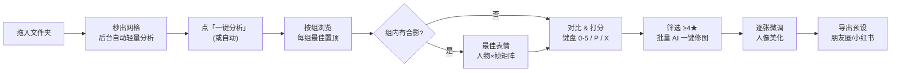

# 04 UI / UX 设计

## 1. 设计原则

| 原则 | 落地方式 |
|---|---|
| **零等待** | 任何操作立即反馈（乐观更新）；分析在后台进行，结果逐步"浮现"；永不弹阻塞式进度对话框 |
| **键盘优先，鼠标友好，触控可用** | 挑片全流程可只用键盘完成；所有快捷键在按钮 Tooltip 中显示；按 `?` 显示快捷键面板；WebUI 在平板/手机上支持手势 |
| **AI 建议，人来决定** | AI 星级以"空心星/虚线"展示，用户星级以实心星展示；"接受建议"是显式操作 |
| **可解释** | 每个 AI 判断都能点开看原因（"左眼闭合 92%"） |
| **非破坏、可撤销** | 全局撤销/重做（Ctrl+Z / Ctrl+Shift+Z），包括批量操作与 AI 助手操作 |
| **渐进披露** | 默认界面简洁；高级参数折叠；新手引导 3 步完成首次挑片 |
| **色彩中立** | 界面以中性灰为主（深色 #1E1E1E / 浅色 #F2F2F2），避免彩色 UI 干扰对照片色彩的判断；强调色仅用于状态 |

## 2. 信息架构

```
imagePicker
├─ 首页（最近会话 / 拖入文件夹 / 导入设备）
├─ 图库（Library）
│  ├─ 左栏：文件夹 · 事件 · 人物 · 智能集合 · 地图(P2)
│  ├─ 中间：网格（按 事件 > 场景 > 连拍堆栈 分区）
│  └─ 右栏：检查器（评分分解 · 人脸 · EXIF · 标签）
├─ 挑片（Cull）—— Loupe 单张 / 对比 2-4-up / 组视图
├─ 最佳表情（Best Take）
├─ 编辑（Edit）—— AI 一键 · 基础 · 色彩 · 局部蒙版 · 人像美化 · 修复 · 预设
├─ 人物（People）
├─ 导出（Export）
├─ 命令面板（Ctrl+K）· AI 助手（全局抽屉，Ctrl+J）
└─ 设置（硬件与模型 · 分析 · 缓存 · 局域网/WebUI · 快捷键 · 语言 · 隐私）
```

**核心流程（Happy Path）**



## 3. 页面线框

### 3.1 首页

```
┌──────────────────────────────────────────────────────────────────────┐
│  imagePicker                                   [⚙ 设置] [🟢 RTX 4090 · T3] │
├──────────────────────────────────────────────────────────────────────┤
│                                                                      │
│        ┌───────────────────────────────────────────┐                 │
│        │      ⬇  把照片文件夹拖到这里                 │                 │
│        │      或 [选择文件夹]   [从 SD 卡/手机导入]   │                 │
│        └───────────────────────────────────────────┘                 │
│                                                                      │
│  最近                                                                 │
│  ┌──────────┐ ┌──────────┐ ┌──────────┐                              │
│  │ [封面图] │ │ [封面图] │ │ [封面图] │                              │
│  │ 京都 2026│ │ 小明生日 │ │ 国庆聚会 │                              │
│  │ 1,204 张 │ │ 356 张   │ │ 812 张   │                              │
│  │ 已选 86  │ │ 分析中 62%│ │ ✓ 已完成 │                              │
│  └──────────┘ └──────────┘ └──────────┘                              │
└──────────────────────────────────────────────────────────────────────┘
```

### 3.2 图库 / 挑片主界面

```
┌─────────────────────────────────────────────────────────────────────────────────┐
│ ◀ 京都 2026   [网格▦][单张▢][对比▥][组▤]   🔍 搜索"海边日落"…   [✨一键分析] [🤖助手] │
├──────────────┬───────────────────────────────────────────────┬──────────────────┤
│ 筛选          │ ★≥[4] ⚑[精选] 👤[小明▾] 🏷[无问题] 场景[全部▾]   排序[AI分▾] 显示 1,204→86 │
│ ─────────    ├───────────────────────────────────────────────┤ 检查器            │
│ 📁 文件夹     │ ▼ Day1 · 10月1日 伏见稻荷（23组 · 186张）       │ ┌──────────────┐ │
│ 📅 事件       │  ▼ 场景：千本鸟居                                │ │  [预览图]     │ │
│  · Day1 伏见  │  ┌────┐┌────┐┌────┐┌────┐┌────┐┌────┐          │ └──────────────┘ │
│  · Day2 岚山  │  │▣ 8 ││    ││▣ 3 ││    ││    ││▣12 │          │ ★★★★☆ 用户       │
│ 👤 人物       │  │★4.5││★3  ││★5  ││★2⚠││★4  ││★4  │          │ ☆☆☆☆☆ AI 4.3     │
│  · 小明 (214) │  └────┘└────┘└────┘└────┘└────┘└────┘          │ ───────────      │
│  · 小红 (180) │   ▣8 = 8 张连拍堆栈，显示 AI 最佳；点击展开       │ 评分分解          │
│  · 未命名(12) │  ▼ 场景：稻荷山顶                                │ 清晰度 ████████░ │
│ ⭐ 智能集合   │  ┌────┐┌────┐┌────┐ …                            │ 曝光   ███████░░ │
│  · 每组最佳   │                                                 │ 人脸   █████░░░░ │
│  · 有人闭眼 ⚠ │                                                 │ 美学   ████████░ │
│  · 待定      │                                                 │ ⚠ 小红右眼半闭    │
│  · 已编辑    │                                                 │ ───────────      │
│              │                                                 │ 人脸 [😀][😑][🙂] │
│              │                                                 │ EXIF  ▸          │
├──────────────┴───────────────────────────────────────────────┴──────────────────┤
│ 分析进度：标准档 ███████████░░░ 78% · 23 张/s · 预计 40s   [暂停]      已选 3 张 [批量…] │
└─────────────────────────────────────────────────────────────────────────────────┘
```

- 缩略图角标：堆栈数、AI/用户星级、旗标、问题图标（⚠ 闭眼 / 🌫 模糊 / ☀ 过曝）、已编辑 ✎。
- **堆栈**：连拍组默认折叠，只显示 AI 推荐的最佳一张；`S` 展开/折叠；展开后组内按 AI 分排序。
- 悬停缩略图 0.5 秒：显示人脸条（该图所有人脸小图 + 睁眼状态）。

### 3.3 组对比视图（挑片核心界面）

```
┌──────────────────────────────────────────────────────────────────────────┐
│ 组 12/23 · 千本鸟居合影 · 8 张        [◀ 上一组 ,]  [下一组 . ▶]   [同步缩放 🔗] │
├───────────────────────────────┬──────────────────────────────────────────┤
│                               │                                          │
│     [ A: 候选 #3 ★5 推荐 ]     │      [ B: 候选 #5 ★4 ]                   │
│                               │                                          │
│      （同步缩放/平移）          │                                          │
├───────────────────────────────┴──────────────────────────────────────────┤
│ 胶片条: [#1 3★][#2 2★⚠][#3 5★✓][#4 3★][#5 4★][#6 2★🌫][#7 4★][#8 3★]    │
├──────────────────────────────────────────────────────────────────────────┤
│ 人物×帧 表情矩阵                                                            │
│        #1    #2    #3    #4    #5    #6    #7    #8                       │
│ 小明  [😀]  [😑]  [😀]  [🙂]  [😀]  [😀]  [🙂]  [😀]   最佳: #1 #3 #5       │
│ 小红  [🙂]  [😀]  [😑]  [😀]  [😀]  [🙂]  [😀]  [😑]   最佳: #2 #4 #5       │
│ 阿强  [😀]  [😀]  [😀]  [😐]  [😑]  [😀]  [😀]  [😀]   最佳: #1 #2 #3       │
│ 💡 没有一张所有人都最佳 → [✨ 生成全员最佳表情合成]                            │
└──────────────────────────────────────────────────────────────────────────┘
```

- `←/→` 切换 B 候选，`Tab` 交换 A/B，`Enter` 选中 A 为本组精选，`Shift+Enter` 精选并跳到下一组。
- 「淘汰其余」：一键将组内其他照片标为淘汰（可撤销）。
- 放大镜模式：按住 `Z` 在鼠标位置 100% 查看，所有对比格同步。
- 表情矩阵中的人脸格：绿框=睁眼笑，黄=一般，红=闭眼/模糊；点击可在大图中定位。

### 3.4 最佳表情编辑器

```
┌──────────────────────────────────────────────────────────────────────────┐
│ 最佳表情 · 底片 #3（自动选择，可更换 ▾）                   [对比原图 \] [完成] │
├──────────────────────────────────────────────────────┬───────────────────┤
│                                                      │ 小红（已选中）      │
│        [ 合成预览大图 ]                                │ 候选表情：         │
│         · 点击任意人脸 → 右侧显示该人的候选              │ ┌───┐┌───┐┌───┐   │
│         · 已替换的人脸显示 ↺ 图标                       │ │#2 ││#4 ││#5 │   │
│                                                      │ │92 ││88 ││85 │   │
│                                                      │ └───┘└───┘└───┘   │
│                                                      │ [显示全部 8 帧]    │
│                                                      │ 融合范围 ──●──     │
│                                                      │ 边缘羽化 ───●─     │
│                                                      │ ⚠ #4 头部偏转较大，  │
│                                                      │   可能需修补        │
│                                                      │ [还原此人]          │
└──────────────────────────────────────────────────────┴───────────────────┘
```

### 3.5 编辑界面

```
┌─────────────────────────────────────────────────────────────────────────┐
│ ◀ 返回   IMG_0423.ARW   [↶][↷]  [前后对比: 分屏 | 切换 \]  历史 ▸   [导出] │
├───────────────────────────────────────────────────┬─────────────────────┤
│                                                   │ ✨ AI 一键           │
│                                                   │ [自动增强] [人像] [风景] │
│              [ 编辑预览（可分屏对比） ]              │ [匹配参考图…]        │
│                                                   │ ── 基础 ──────────  │
│                                                   │ 曝光     ──●──  +0.35│
│                                                   │ 对比度   ───●─  +12  │
│                                                   │ 高光/阴影/白/黑 …    │
│                                                   │ 色温/色调 …          │
│                                                   │ ▸ 曲线  ▸ HSL  ▸ 分级 │
│                                                   │ ── 局部（AI 蒙版）── │
│                                                   │ [主体][天空][背景]    │
│                                                   │ [人物▾][皮肤][头发]   │
│                                                   │ ── 人像美化 ─────── │
│                                                   │ 作用于：[小红 ✓][小明] │
│                                                   │ 档位：自然|标准|精致   │
│                                                   │ 磨皮 ──●── 美白 ─●──  │
│                                                   │ 瘦脸 ─●─── 大眼 ●──── │
│                                                   │ 瘦手臂 ●── 瘦腿 ─●──  │
│                                                   │ ── 修复 ─────────── │
│                                                   │ [🧽 消除路人(检测到2)] │
│                                                   │ [画笔消除] [人脸修复]  │
│                                                   │ ── 预设 ─────────── │
├───────────────────────────────────────────────────┴─────────────────────┤
│ 胶片条（当前筛选结果）   [复制设置 Ctrl+Shift+C] [粘贴到所选 Ctrl+Shift+V] [同步到本组] │
└─────────────────────────────────────────────────────────────────────────┘
```

- 滑块：双击复位；Alt+拖动显示蒙版/剪切警告；滚轮微调。
- 蒙版可视化：按 `O` 叠加红色蒙版。
- 生成式操作（消除、Best Take）显示进度环与"可取消"，完成后作为可开关的图层出现在历史中。

### 3.6 人物页

网格显示人物卡（代表人脸 + 名字 + 张数）；点击进入该人物所有照片；支持拖拽合并、"不是此人"拆分、隐藏人物、为人物设置美颜档案。多选人物卡后可「查看同框照片」「每人最佳 N 张」「按人物导出」。

### 3.6.1 人物筛选器（筛选栏 👤 下拉，`Shift+P`）

```
┌ 人物筛选 ─────────────────────────────────────────────┐
│ 匹配方式：(●) 全部同框 AND   ( ) 任一 OR                 │
│ ┌────┐┌────┐┌────┐┌────┐┌────┐┌────┐                    │
│ │ 😀 ││ 🙂 ││ 😐 ││ 🙂 ││ ？ ││ ？ │  [🔍 搜索人物…]     │
│ │小明✓││小红✓││阿强⊘││妈妈 ││未命名││未命名│  [📷 以脸搜脸]     │
│ └────┘└────┘└────┘└────┘└────┘└────┘                    │
│  单击切换：未选 → ✓ 包含 → ⊘ 排除                          │
│ 选中人物需满足：[✓ 睁眼] [✓ 笑容] [ 看镜头] [✓ 是主角]       │
│ 人数：(●) 不限 ( ) 单人 ( ) 2–3 人 ( ) ≥ [4] 人 ( ) 无人     │
│ [ ] 包括作为背景路人出现的照片                              │
│ [ ] 每人最佳 [3] 张（结果按人物分区）                        │
│                       结果：37 张  [保存为智能集合] [应用]   │
└───────────────────────────────────────────────────────┘
```

- 生效的人物条件以「筛选药丸」显示在筛选栏：`👤 小明 + 小红 · 睁眼 · 笑` `⊘ 阿强`，点 × 移除。
- **点脸即筛**：检查器人脸条、大图人脸框（`Shift+F` 显示）上右键 →「筛选有此人的照片」/「排除此人」/「命名…」。
- **每人最佳**开启时，导出对话框提供「按人物分文件夹导出」。

### 3.7 导出对话框

左侧：导出预设列表（朋友圈 / 小红书 3:4 / Instagram 4:5 / 原尺寸 JPEG / 打印 TIFF）；右侧：格式、质量、尺寸、色彩空间、元数据（保留/去 GPS）、命名模板实时示例、目标文件夹、导出后操作（打开文件夹）。底部显示预计大小与数量。

### 3.8 AI 助手抽屉

```
┌ AI 助手 ─────────────────────────────── ✕ ┐
│ 🤖 已分析 1,204 张：23 个场景，发现 41 张闭眼、 │
│    18 张模糊。建议先处理「有人闭眼」集合。      │
│                                            │
│ 🧑 每个场景只留最好的 2 张，其他标为淘汰       │
│                                            │
│ 🤖 计划：                                   │
│    1. 按场景分组（23 组）                     │
│    2. 每组保留 AI 分前 2 名 → 精选            │
│    3. 其余 1,158 张 → 淘汰（不会删除文件）     │
│    [预览影响] [执行] [取消]                    │
├────────────────────────────────────────────┤
│ 💬 输入指令…              [常用: 挑最佳|统一色调] │
└────────────────────────────────────────────┘
```

## 4. 快捷键（默认，兼容 Lightroom 习惯）

| 键 | 功能 | 键 | 功能 |
|---|---|---|---|
| `0`–`5` | 设置星级 | `P` / `X` / `U` | 精选 / 淘汰 / 取消旗标 |
| `6`–`9` | 色标 红/黄/绿/蓝 | `Shift`+评分键 | 评分并跳到下一张 |
| `←` `→` | 上一张/下一张 | `,` `.` | 上一组/下一组 |
| `G` / `E` / `C` / `B` | 网格 / 单张 / 对比 / 组视图 | `D` | 编辑 |
| `S` | 展开/折叠堆栈 | `Z`（按住） | 100% 放大镜 |
| `Space` | 适应/100% 切换 | `\` | 前后对比 |
| `A` | 接受 AI 星级（当前/所选） | `Ctrl+Shift+A` | 接受所有 AI 建议（需确认） |
| `F` | 全屏 | `Tab` | 隐藏侧栏 |
| `Shift+F` | 显示/隐藏人脸框 | `Shift+P` | 打开人物筛选器 |
| `Ctrl+K` / `Ctrl+J` | 命令面板 / AI 助手 | `?` | 快捷键帮助 |
| `Ctrl+Z` / `Ctrl+Shift+Z` | 撤销 / 重做 | `Ctrl+E` | 导出 |

macOS 中 `Ctrl` 对应 `⌘`。快捷键可在设置中自定义。

## 5. 触控/平板（WebUI）手势

| 手势 | 功能 |
|---|---|
| 左右滑 | 上一张/下一张 |
| 上滑 | 精选 |
| 下滑 | 淘汰 |
| 双指缩放 / 双击 | 缩放 / 适应↔100% |
| 长按 | 多选 |

## 6. 视觉规范

| 项 | 规范 |
|---|---|
| 主题 | 默认深色（中性灰 #1E1E1E 背景、#2A2A2A 面板、#3A3A3A 分隔）；浅色主题可选 |
| 强调色 | 品牌色琥珀 #F5A524（选中/主按钮）；状态：成功 #3FB950、警告 #D29922、错误 #F85149；AI 相关元素统一使用紫色 #A371F7 + ✨ 图标，使用户一眼区分"AI 建议" |
| 字体 | 界面：系统 UI 字体（Segoe UI / SF Pro / Noto Sans CJK）；数字：等宽表格数字 |
| 字号 | 12 / 13（正文）/ 15 / 20 |
| 间距 | 4px 网格 |
| 圆角 | 6px（控件）、8px（卡片）；缩略图 2px |
| 动效 | 120–200ms，ease-out；尊重系统"减少动态效果"设置 |
| 图标 | Lucide |
| 无障碍 | 对比度 ≥ 4.5:1；所有图标按钮有 aria-label；焦点环可见 |

## 7. 新手引导与空状态

1. 首次启动：硬件检测结果卡片（"检测到 RTX 4090，推荐 T3 档位，需下载约 6GB 模型，可稍后"）→ 选择「先用基础功能」或「下载 AI 组件」（后台下载，不阻塞使用）。
2. 首次导入后：轻提示气泡依次指向「一键分析」「堆栈」「数字键打分」。
3. 空状态都有明确下一步（如人物页为空："分析完成后这里会出现照片中的人物"）。

## 8. 错误与边界体验

| 情况 | 体验 |
|---|---|
| 模型下载失败 | 自动切换镜像源重试；显示"使用经典算法继续"选项 |
| GPU 显存不足 | 自动降档重试，状态栏提示"已切换到较小模型" |
| 文件被移动/删除 | 缩略图显示断链图标，提供"重新定位文件夹" |
| 不支持的 RAW | 回退到内嵌预览，提示"完整解码不支持此机型" |
| 分析中退出 | 下次打开自动继续 |
