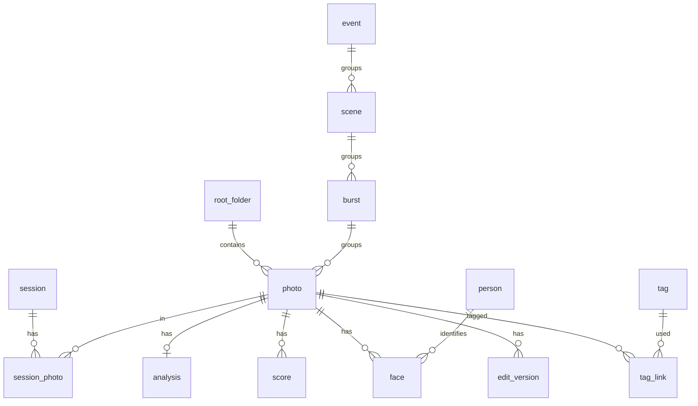

# 05 数据模型与接口设计

## 1. 数据库（SQLite，catalog.db）

PRAGMA：`journal_mode=WAL`、`synchronous=NORMAL`、`foreign_keys=ON`、`mmap_size=268435456`。迁移由 `refinery` / 内置版本表管理。



### 1.1 主要表

```sql
CREATE TABLE root_folder (
  id INTEGER PRIMARY KEY, path TEXT UNIQUE NOT NULL,
  portable INTEGER DEFAULT 0, added_at INTEGER NOT NULL
);

CREATE TABLE photo (
  id INTEGER PRIMARY KEY,
  root_id INTEGER REFERENCES root_folder(id),
  rel_path TEXT NOT NULL,                 -- 相对根目录
  file_size INTEGER, mtime INTEGER,
  fast_key TEXT NOT NULL,                 -- hash(path,size,mtime)
  content_key TEXT,                       -- blake3(head+tail+size)
  format TEXT,                            -- jpeg/heic/raw:arw/...
  pair_id INTEGER,                        -- RAW+JPEG 配对的另一张
  width INTEGER, height INTEGER, orientation INTEGER,
  taken_at INTEGER,                       -- 毫秒，已应用设备偏移
  taken_at_raw INTEGER, device_id INTEGER REFERENCES device(id),
  camera TEXT, lens TEXT, focal REAL, aperture REAL, shutter REAL, iso INTEGER,
  gps_lat REAL, gps_lon REAL,
  burst_id INTEGER REFERENCES burst(id),
  rank_in_burst INTEGER,
  -- 用户决定（永远优先）
  user_rating INTEGER CHECK(user_rating BETWEEN 0 AND 5),
  flag INTEGER DEFAULT 0,                 -- 1 精选 / -1 淘汰 / 0 无
  color_label TEXT,
  -- AI 建议
  ai_score REAL, ai_rating REAL,          -- ai_rating 允许 0.5 步长展示
  issues INTEGER DEFAULT 0,               -- 位掩码：1闭眼 2模糊 4过曝 8欠曝 16倾斜 32路人 ...
  scene_type TEXT,
  thumb_state INTEGER DEFAULT 0,          -- 0 无 1 内嵌 2 网格 3 预览
  analysis_version INTEGER DEFAULT 0,
  has_edits INTEGER DEFAULT 0,
  face_count INTEGER, subject_face_count INTEGER,   -- 分析阶段回填，用于人数筛选
  missing INTEGER DEFAULT 0,
  UNIQUE(root_id, rel_path)
);
CREATE INDEX idx_photo_taken ON photo(taken_at);
CREATE INDEX idx_photo_burst ON photo(burst_id, rank_in_burst);
CREATE INDEX idx_photo_rating ON photo(user_rating, ai_rating);

CREATE TABLE device (id INTEGER PRIMARY KEY, make TEXT, model TEXT, serial TEXT,
                     time_offset_ms INTEGER DEFAULT 0, offset_source TEXT); -- auto/manual

CREATE TABLE event (id INTEGER PRIMARY KEY, title TEXT, start_at INTEGER, end_at INTEGER, place TEXT);
CREATE TABLE scene (id INTEGER PRIMARY KEY, event_id INTEGER REFERENCES event(id), title TEXT, start_at INTEGER);
CREATE TABLE burst (id INTEGER PRIMARY KEY, scene_id INTEGER REFERENCES scene(id),
                    best_photo_id INTEGER, size INTEGER, manual INTEGER DEFAULT 0);

CREATE TABLE analysis (
  photo_id INTEGER PRIMARY KEY REFERENCES photo(id) ON DELETE CASCADE,
  steps_done INTEGER,                     -- 位掩码：嵌入/IQA/人脸/分割/…
  model_versions TEXT,                    -- JSON {step: model_id@ver}
  phash BLOB,                             -- 8 字节
  embedding BLOB,                         -- f16 向量（SigLIP 768/1152d）
  sharpness REAL, exposure REAL, noise REAL, tilt_deg REAL,
  aesthetic REAL, iqa REAL, composition REAL,
  explain TEXT,                           -- JSON：分项贡献与理由
  artifacts_dir TEXT                      -- 缓存目录（蒙版、关键点等）
);

CREATE TABLE face (
  id INTEGER PRIMARY KEY,
  photo_id INTEGER REFERENCES photo(id) ON DELETE CASCADE,
  person_id INTEGER REFERENCES person(id),
  track_id INTEGER,                       -- 连拍组内同一人的轨迹
  bbox TEXT,                              -- [x,y,w,h] 归一化
  det_score REAL, embedding BLOB,         -- 512d f16
  eyes_open REAL, smile REAL, gaze REAL, yaw REAL, pitch REAL, roll REAL,
  sharpness REAL, occlusion REAL, expression_score REAL,
  is_subject INTEGER, is_bystander INTEGER,
  landmarks_path TEXT, blendshapes TEXT   -- JSON 52 系数
);
CREATE INDEX idx_face_person ON face(person_id, photo_id);
CREATE INDEX idx_face_photo ON face(photo_id);

CREATE TABLE person (id INTEGER PRIMARY KEY, name TEXT, cover_face_id INTEGER,
                     hidden INTEGER DEFAULT 0, beauty_profile TEXT); -- JSON

CREATE TABLE edit_version (
  id INTEGER PRIMARY KEY, photo_id INTEGER REFERENCES photo(id) ON DELETE CASCADE,
  name TEXT,                              -- "主版本" / "虚拟副本 1"
  stack TEXT NOT NULL,                    -- JSON 编辑栈（见 §2）
  updated_at INTEGER, is_current INTEGER DEFAULT 1
);

CREATE TABLE history (                    -- 全局撤销/重做
  id INTEGER PRIMARY KEY, at INTEGER, kind TEXT, -- rating/flag/edit/group/assistant
  payload TEXT, inverse TEXT, batch_id TEXT
);

CREATE TABLE preference_label (           -- 个性化训练数据
  id INTEGER PRIMARY KEY, at INTEGER, kind TEXT, -- explicit/pairwise
  winner_id INTEGER, loser_id INTEGER, rating INTEGER
);

CREATE TABLE task (id TEXT PRIMARY KEY, kind TEXT, status TEXT, priority INTEGER,
                   params TEXT, progress REAL, error TEXT, created_at INTEGER, updated_at INTEGER);

CREATE TABLE session (id INTEGER PRIMARY KEY, title TEXT, cover_photo_id INTEGER, created_at INTEGER);
CREATE TABLE session_photo (session_id INTEGER, photo_id INTEGER, PRIMARY KEY(session_id, photo_id));
CREATE TABLE smart_collection (id INTEGER PRIMARY KEY, name TEXT, query TEXT);  -- JSON 筛选
CREATE TABLE tag (id INTEGER PRIMARY KEY, name TEXT UNIQUE);
CREATE TABLE tag_link (photo_id INTEGER, tag_id INTEGER, source TEXT, PRIMARY KEY(photo_id, tag_id));
```

### 1.2 向量检索

- 会话规模（≤ 2 万张）：启动时把嵌入载入内存（2 万 × 1152 × f16 ≈ 46MB），暴力余弦 + SIMD，< 5ms。
- 大库（10 万+）：启用 `sqlite-vec` 虚拟表或 HNSW（`hnsw_rs`）索引。

## 2. 编辑栈格式（Edit Stack v1）

```jsonc
{
  "version": 1,
  "base": { "photo_id": 4231, "raw": { "wb": "as_shot", "demosaic": "amaze" } },
  "ops": [
    { "id": "op1", "type": "crop", "rect": [0.02,0.05,0.96,0.9], "angle": -1.3, "aspect": "4:5" },
    { "id": "op2", "type": "patch", "kind": "best_take", "person_id": 12,
      "source_photo_id": 4229, "asset": "edits/4231/bt_12.webp", "mask": "edits/4231/bt_12_mask.png",
      "transform": [[...]], "feather": 12, "enabled": true },
    { "id": "op3", "type": "patch", "kind": "inpaint", "model": "lama@1", "asset": "...", "mask": "..." },
    { "id": "op4", "type": "warp", "kind": "face", "person_id": 12, "level": "natural", "slim": 25, "chin": 0, "eyes": 10, "nose": 0 },
    { "id": "op5", "type": "warp", "kind": "body", "person_id": 12, "level": "natural",
      "arms": 20, "legs": 15, "waist": 10, "lengthen_legs": 0, "protect_background": true },
    { "id": "op6", "type": "global",
      "exposure": 0.35, "contrast": 12, "highlights": -30, "shadows": 22, "whites": 5, "blacks": -4,
      "temp": 300, "tint": 2, "vibrance": 10, "saturation": 0, "clarity": 8, "dehaze": 0,
      "curve": { "rgb": [[0,0],[0.25,0.22],[0.75,0.8],[1,1]] },
      "hsl": { "orange": { "h": 0, "s": -5, "l": 8 } },
      "grading": { "shadows": [220, 0.1], "highlights": [40, 0.08] },
      "source": "ai_auto@2" },
    { "id": "op7", "type": "local", "mask": { "kind": "ai", "target": "sky" },
      "adjust": { "exposure": -0.3, "saturation": 10 } },
    { "id": "op8", "type": "beauty", "person_id": 12, "level": "natural",
      "smooth": 30, "whiten": 20, "blemish": true, "eye_brighten": 10, "teeth_whiten": 0, "dark_circles": 0 },
    { "id": "op9", "type": "lut", "file": "presets/film_warm.cube", "amount": 0.6 },
    { "id": "op10", "type": "output_sharpen", "amount": 20 }
  ]
}
```

- 渲染引擎按固定管线顺序（见架构文档 §5.3）执行，`ops` 中同类操作按出现顺序。
- 引用人物/蒙版的操作在渲染时**按需重新生成**AI 资产（缓存失效时），因此编辑栈可复制到其他照片：`person_id` 在目标照片中找到同一人物即生效，找不到则跳过并提示。
- 预设 = 编辑栈中不含照片特定资产的子集。

## 3. API（HTTP + WebSocket）

基址：`http://127.0.0.1:<port>/api`，认证头 `Authorization: Bearer <token>`（局域网模式使用登录后的会话 Cookie）。OpenAPI 由 `utoipa` 自动生成，前端用 `openapi-typescript` 生成类型。

### 3.1 资源接口

| 方法 | 路径 | 说明 |
|---|---|---|
| POST | `/import` | `{paths[], session_title?, recursive, exclude[]}` → `{session_id, task_id}` |
| GET | `/sessions` / `/sessions/{id}` | 会话列表 / 详情（统计） |
| GET | `/photos` | 查询：`session_id, rating_gte, flag, scene_type, issues_none, issues_any, burst_id, q(自然语言), sort, cursor, limit`；人脸筛选参数见 §3.2 → 分页 |
| GET | `/photos/{id}` | 详情（含评分分解、人脸、EXIF） |
| PATCH | `/photos` | 批量更新 `{ids[], user_rating?, flag?, color_label?}`（写 history） |
| POST | `/photos/accept-ai` | 将 AI 星级写入用户星级 `{ids[] | query}` |
| GET | `/thumb/{id}?s=256\|512` | 缩略图（ETag/Cache-Control immutable） |
| GET | `/preview/{id}?s=2048` | 预览图 |
| GET | `/original/{id}` | 原图流（Range 支持） |
| GET | `/groups?session_id=` | 事件 → 场景 → 连拍组树 |
| POST | `/groups/split` / `/groups/merge` | 手动拆分/合并组 |
| POST | `/groups/{id}/keep-top` | `{n, reject_rest}` |
| GET | `/faces?photo_id= / burst_id=` | 人脸列表（表情矩阵数据） |
| GET | `/faces/{id}/crop` | 人脸裁切图 |
| GET/PATCH | `/people` / `/people/{id}` | 人物列表、命名、隐藏、美颜档案 |
| POST | `/people/merge` / `/people/{id}/split` | 合并 / 拆分 |
| POST | `/faces/search` | multipart 图片 或 `{face_id}` → `{faces_detected:[bbox], candidates:[{person_id, similarity}], similar_faces:[{face_id, photo_id, similarity}]}` |
| GET | `/people/best?ids=1,2&n=3` | 每人最佳 N 张：`{people:[{person_id, photos:[{photo_id, score}]}]}` |
| DELETE | `/faces?confirm=true` | 清除全部人脸数据与人物库 |
| POST | `/analysis/run` | `{scope, profile: fast\|standard\|deep, steps?}` → task_id |
| POST | `/tasks/{id}/pause\|resume\|cancel` | 任务控制 |
| GET/PUT | `/edits/{photo_id}` | 读取/保存编辑栈 |
| POST | `/edits/{photo_id}/auto` | AI 一键，返回建议参数（不直接保存） |
| POST | `/edits/sync` | `{from_id, to_ids[], adaptive: true}` |
| POST | `/render/preview` | `{photo_id, stack, long_edge, region?}` → 二进制图像 |
| POST | `/besttake/{burst_id}/plan` | 返回底片建议与每人候选 |
| POST | `/besttake/{burst_id}/compose` | `{base_id, choices: {person_id: photo_id}}` → patch ops |
| POST | `/inpaint/{photo_id}` | `{mask | targets: bystanders}` → patch op（异步） |
| POST | `/export` | `{ids[], preset | options}` → task_id |
| GET/POST | `/models` / `/models/{id}/download` / `DELETE /models/{id}` | 模型管理 |
| GET | `/system/hardware` | 硬件与档位 |
| POST | `/assistant/chat` | `{messages[], context}` → 流式（SSE）计划/回复 |
| POST | `/assistant/execute` | 执行已确认的计划 |
| POST | `/undo` / `/redo` | 全局撤销/重做 |
| GET | `/fs/browse?path=` | WebUI 模式下的服务端目录浏览（仅白名单根） |

### 3.2 人脸筛选参数（`GET /photos`）

| 参数 | 示例 | 说明 |
|---|---|---|
| `persons` | `1,2` | 包含的人物 ID |
| `person_mode` | `all` / `any` | 全部同框（默认）/ 任一 |
| `exclude_persons` | `3` | 排除的人物 ID |
| `face_ids` | `881` | 点脸即筛：按某张脸（未聚类时按嵌入近邻） |
| `person_state` | `eyes_open,smiling,looking,subject,sharp` | `persons` 中每个人都须满足 |
| `include_background` | `false` | 是否也匹配作为背景路人出现的人脸 |
| `faces_min` / `faces_max` | `2` / `3` | 主体人数范围；`faces_max=0` 即无人照 |

### 3.3 WebSocket 事件 `/api/events`

```jsonc
// 服务器 → 客户端（批量合并，最多每 100ms 一帧）
{ "type": "photos.added",     "session_id": 3, "ids": [..] }
{ "type": "thumbs.ready",     "items": [{ "id": 12, "s": 256, "v": "a1b2" }] }
{ "type": "task.progress",    "task_id": "t_9", "kind": "analysis", "done": 780, "total": 1204, "rate": 23.1, "eta_s": 19 }
{ "type": "photos.updated",   "items": [{ "id": 12, "ai_rating": 4.5, "issues": 1 }] }
{ "type": "groups.updated",   "session_id": 3 }
{ "type": "model.download",   "id": "siglip2-base", "bytes": 1.2e8, "total": 3.7e8 }
{ "type": "worker.status",    "state": "ready|loading|oom_fallback|crashed", "tier": "T3" }
// 客户端 → 服务器
{ "type": "viewport",         "ids": [..] }   // 视口内照片，提升缩略图/分析优先级
```

## 4. Core ⇄ AI Worker 协议

WebSocket JSON-RPC 2.0，地址由 Core 启动 Worker 时通过环境变量指定（`IP_WORKER_ADDR`、`IP_WORKER_TOKEN`）。Worker 也可运行在另一台机器（远程 GPU）。

```jsonc
// 请求
{ "jsonrpc":"2.0", "id": 101, "method": "analyze.batch",
  "params": { "items":[{"photo_id":12,"path":"E:/DCIM/IMG_0001.JPG","orientation":1}],
              "steps":["embed","iqa","faces","segment"], "analysis_size":1024,
              "out_dir":"<cache>/analysis" } }
// 流式进度（通知）
{ "jsonrpc":"2.0", "method":"progress", "params": { "req":101, "done":32, "total":64 } }
// 结果
{ "jsonrpc":"2.0", "id":101, "result": { "items":[{ "photo_id":12,
    "embedding_file":"…/12.emb.f16", "iqa":0.71, "aesthetic":0.64, "sharpness":0.82,
    "faces":[{ "bbox":[…], "emb_file":"…", "eyes_open":0.97, "smile":0.62, … }],
    "masks": { "person":"…/12_person.png", "skin":"…/12_skin.png" } }] } }
```

| 方法 | 说明 |
|---|---|
| `system.info` | 硬件、档位、已加载模型、显存 |
| `analyze.batch` | 批量分析 |
| `faces.landmarks` | 指定人脸的高精度关键点（编辑时） |
| `mask.generate` | `{photo, target: sky/subject/person:k/skin/hair, points?}` |
| `beauty.prepare` | 生成皮肤蒙版、瑕疵点、脸型/身体形变场 |
| `besttake.compose` | 对齐 + 融合，输出补丁与蒙版 |
| `inpaint.run` | `{photo, mask, model: lama\|sdxl\|flux}` |
| `enhance.run` | 降噪 / 超分 / 人脸修复 |
| `color.auto` | 返回自动调整参数 |
| `color.match_reference` | 风格参考迁移参数 |
| `vlm.chat` | VLM / LLM 推理（助手） |
| `models.ensure` | 确保模型就绪（必要时下载），流式进度 |
| `models.unload` | 释放显存 |

## 5. XMP 侧车互通

- 读：导入时若存在 `IMG_0001.xmp`（或 JPEG 内嵌 XMP），读取 `xmp:Rating`、`xmp:Label`、`xmpDM:pick`/`lr:hierarchicalSubject`、darktable 的 `xmp:Rating`（-1 表示 reject）。
- 写（可配置：关闭 / 仅侧车 / 侧车+JPEG 内嵌）：用户评分、色标、旗标（Lightroom 无标准 pick 字段，采用 `xmp:Rating=-1` 表示淘汰的 darktable 约定，并在设置中说明）、关键词、标题。
- 冲突策略：以最后修改时间为准，冲突时提示用户选择。
- **不写入**编辑栈到第三方格式（各软件不兼容）；可导出自有 `.ipedit.json`。
