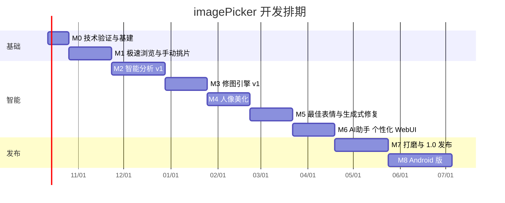

# 06 项目计划书

> **2026-10-09 现状说明**：本计划编制于 2026-10-06。M1–M8 的代码已在 2026-10-06 至 10-09 落地（尚无发布），但各里程碑的验收指标大多还没有在真实模型或真实照片上测过。下文 §2 的日历排期与 §8「立即下一步」已失效；实际进度、缺口与验收标准、并行工作包和按发布门槛推进的剩余计划见 [09 完成度评审与收尾计划](09-完成度评审与收尾计划.md)。§3 各里程碑的验收标准、§4 规范、§5 测试策略与 §6 风险仍然有效。

## 1. 项目概况

| 项 | 内容 |
|---|---|
| 项目名称 | imagePicker —— 本地 AI 照片挑选与修图工作台 |
| 开源形式 | GitHub 公开仓库，Apache-2.0 许可 |
| 目标平台 | Windows 10/11、Linux（CachyOS/Arch 优先，兼顾 Ubuntu）、macOS 13+（Apple Silicon 优先）、Android 10+ |
| 开发资源假设 | 1 名全职开发者 + AI 编程助手；（可选）1 名兼职设计/测试 |
| 开发机 | Windows 11 + RTX 4090 24GB（主力）、CachyOS（Linux 验证与自托管 GPU CI Runner）、Mac（借用/云 Mac 验证）、Android 真机 |
| 计划周期 | 约 32 周（M0 已于 2026-10-06 提前启动 → 2027-05-21）到 1.0；Android 1.0 随后 6 周 |

## 2. 里程碑总览

| 里程碑 | 名称 | 周期 | 核心交付 | 对外版本 |
|---|---|---|---|---|
| M0 | 技术验证 & 工程基建 | 2 周 | 骨架工程、性能 PoC、CI | — |
| M1 | 极速浏览与手动挑片 | 4 周 | 导入、缩略图、网格、Loupe、对比、评分、筛选、导出 | v0.1.0（Alpha） |
| M2 | 智能分析 v1 | 5 周 | AI Worker、硬件分级、模型管理、分组、评分、闭眼检测、人物聚类 | v0.2.0 |
| M3 | 修图引擎 v1 | 4 周 | wgpu 渲染管线、基础调整、AI 一键、预设/LUT、同步、智能蒙版 | v0.3.0 |
| M4 | 人像美化 | 4 周 | 磨皮/美白/去瑕疵、瘦脸大眼、身体形变、按人物应用 | v0.4.0（Beta） |
| M5 | 最佳表情 & 生成式修复 | 4 周 | 表情矩阵、Best Take 合成、路人消除、降噪/超分/人脸修复 | v0.5.0 |
| M6 | AI 助手 · 个性化 · WebUI | 4 周 | 助手工具调用、VLM 建议、个性化评分、局域网 WebUI、XMP | v0.6.0 |
| M7 | 打磨与发布 | 5 周 | 三平台打包、性能优化、评测达标、文档、1.0 发布 | **v1.0.0** |
| M8 | Android 版 | 6 周（1.0 之后） | Tauri Android、端侧推理 ip-infer、远程 Worker | Android v1.0 |

> 春节（2027-02 上旬）预留缓冲已含在 M5 内；每个里程碑末留 2–3 天做回归与发布。M2 开始后，可并行由 ip-infer 为 Android 做前期验证（不占主线）。

## 3. 工作分解（WBS）与验收标准

### M0 技术验证与工程基建（2 周）

| 任务 | 说明 |
|---|---|
| 仓库与工具链 | monorepo 结构（见架构 §4）；Cargo workspace、pnpm、uv；pre-commit（rustfmt/clippy/eslint/prettier/ruff） |
| CI | GitHub Actions：三平台构建 + 单测；Linux 自托管 4090 Runner 跑 GPU 测试（夜间） |
| PoC-1 缩略图 | 1000 张 24MP JPEG + 300 张 RAW 的缩略图吞吐基准 |
| PoC-2 前端网格 | 2 万项虚拟网格滚动帧率 |
| PoC-3 Worker | Rust ↔ Python JSON-RPC、ONNX Runtime 在 CUDA / CoreML / CPU 上跑通 SigLIP2 |
| PoC-4 渲染 | wgpu 曝光/白平衡 shader，24MP 预览延迟 |
| PoC-5 Android 可行性（轻量） | Tauri Android Hello World + 加载 Rust core |

**验收**：PoC 指标达到 PRD 非功能需求的 80%；ADR 定稿；CI 绿。

### M1 极速浏览与手动挑片（4 周）

| 任务 | 说明 |
|---|---|
| 目录库 | SQLite 模式、迁移、导入扫描、EXIF、RAW+JPEG 配对、文件监听 |
| 缩略图流水线 | 内嵌预览提取、DCT 缩放、视口优先队列、缓存 |
| 前端框架 | 路由、主题、i18n、快捷键系统、命令面板、撤销/重做 |
| 网格 & Loupe & 对比 | 虚拟网格、WebGL 大图查看器（瓦片）、2/4-up 同步缩放 |
| 评分与筛选 | 星级/旗标/色标、组合筛选、智能集合基础 |
| 导出 v1 | JPEG/PNG/WebP、尺寸、命名模板、EXIF 选项 |
| 桌面打包 | Windows NSIS 安装包（每周构建） |

**验收**：导入 1000 张 JPEG 首屏 < 1s、全部缩略图 < 10s；全键盘完成一次挑片与导出；崩溃不丢评分。

### M2 智能分析 v1（5 周）

| 任务 | 说明 |
|---|---|
| AI Worker 框架 | 进程管理、重启、RPC、日志；`uv` 环境自动安装（cpu/cuda/mps 变体） |
| 硬件检测 & 档位 | 探测 + 微基准 + 推荐 |
| 模型管理 | registry、下载（HF/镜像/ModelScope）、校验、UI |
| 分析步骤 | 嵌入、pHash、清晰度/曝光/噪点、IQA、美学、人脸检测/关键点/表情/身份 |
| 分组 | 时间线、多设备对齐、三级分组、手动拆合 |
| 评分 | 分项 → 综合 → 星级映射、问题标签、可解释面板 |
| 人物 | 聚类、命名、合并拆分、人物页 |
| 按人脸筛选 | 多人 AND/OR/NOT、按人状态、点脸即筛、人数、每人最佳、按人物导出；以脸搜脸（P2，可延后） |
| 人脸隐私 | 首次启用同意、整体开关、一键清除 |
| 自然语言搜索 | SigLIP 文本查询 |
| 评测集 | 标注 3000 张自有照片（分组、组内最佳、闭眼） |

**验收**：4090 标准档 1000 张 < 2 分钟；分组 F1 ≥ 0.85；Top-3 命中 ≥ 75%；闭眼召回 ≥ 90%；无 GPU 机器快速档可用；人物聚类 BCubed F1 ≥ 0.85；万张库人脸组合筛选 < 100ms。

### M3 修图引擎 v1（4 周）

| 任务 | 说明 |
|---|---|
| 渲染管线 | 编辑栈解析、wgpu WGSL 着色器、色彩管理（ICC）、分块导出、CPU 兜底 |
| 基础调整 | 曝光…去雾、曲线、HSL、色彩分级 |
| AI 一键 | 自动 WB/曝光/色彩（规则 + 学习模型）输出参数 |
| 智能蒙版 | 主体/天空/背景/人物/皮肤；局部调整 |
| 预设与 LUT | 内置 10 款预设、.cube 导入、复制粘贴设置、组内自适应同步 |
| 裁剪 | 比例、拉直、自动水平 |
| 黄金图测试 | 渲染结果像素级回归测试（各平台容差内一致） |

**验收**：24MP 照片滑块预览 < 50ms（4090）/ < 150ms（集显）；预览与导出 ΔE < 1；AI 一键盲评优于原图 ≥ 70%。

### M4 人像美化（4 周）

| 任务 | 说明 |
|---|---|
| 皮肤 | 皮肤/人脸解析蒙版、频率分离磨皮、美白/肤色、去瑕疵 |
| 脸部 | 关键点形变（瘦脸、小脸、下巴、大眼）、眼部提亮 |
| 身体 | 姿态估计、人体分割、骨骼导向形变、背景直线保护 |
| 按人物 | 人物选择器、美颜档案、批量一致应用 |
| 自然度保护 | 三档上限、失真检测提示 |

**验收**：30 张人像盲评自然度 MOS ≥ 3.8/5；背景直线弯曲检测误报 < 10%；单人美颜预览 < 200ms（形变场缓存后）。

### M5 最佳表情 & 生成式修复（4 周）

| 任务 | 说明 |
|---|---|
| 表情矩阵 UI | 人物×帧、候选推荐、定位 |
| Best Take 合成 | 全局/局部对齐、蒙版、颜色匹配、多频段融合、质检 |
| 路人消除 | 路人自动检测、LaMa（全档）/ SDXL Inpaint（T3）、画笔消除 |
| 身体形变背景补全 | 用修补模型填充收缩露出的背景 |
| 增强 | 降噪、超分、人脸修复 |
| 显存调度 | 大模型互斥、LRU、OOM 降档 |

**验收**：Best Take 50 组人工评审 MOS ≥ 3.8、明显伪影率 < 15%；路人消除 T3 单张 < 10s；24GB 下连续运行 2 小时无 OOM 崩溃。

### M6 AI 助手 · 个性化 · WebUI（4 周）

| 任务 | 说明 |
|---|---|
| 助手 | 工具定义（与 API 对应）、本地 LLM/VLM、离线规则解析器、计划预览与确认、整体撤销 |
| 看图建议 | VLM 结构化建议 → 参数 |
| 个性化评分 | 偏好数据采集、排序头训练、融合与回退、「我的口味」页 |
| WebUI / 局域网 | `serve --lan`、登录鉴权、服务端目录浏览、触控手势、二维码配对 |
| XMP 互通 | 读写 Rating/Label/Pick/关键词 |
| 深度分析档 | Q-Align / VLM 级联评审 |

**验收**：20 条常用指令解析成功率 ≥ 90%（T3）/ ≥ 75%（离线解析器）；个性化后星级一致率提升 ≥ 5 个百分点；iPad/手机浏览器可完成挑片全流程；Lightroom 与 darktable 能读取评分。

### M7 打磨与 1.0 发布（5 周）

| 任务 | 说明 |
|---|---|
| 打包 | Windows（NSIS/MSI，代码签名可选）、macOS（DMG，公证）、Linux（AppImage + AUR PKGBUILD）；AI 组件首次运行安装器 |
| 自动更新 | Tauri updater + GitHub Releases |
| 性能优化 | 冷启动、内存、万张库压测、Profile 热点 |
| 质量 | E2E（Playwright 驱动 WebUI）、崩溃收集（本地）、可访问性检查 |
| 文档 | 用户手册、快捷键表、FAQ、贡献指南、模型许可页 |
| 发布 | 1.0 Release Notes、演示视频/GIF、README |

**验收**：PRD 非功能指标全部达标；三平台安装 → 导入 → 分析 → 修图 → 导出全流程通过；P0/P1 缺陷清零。

### M8 Android 版（6 周）

| 任务 | 说明 |
|---|---|
| ip-infer | Rust `ort` 端侧推理（NNAPI/QNN/XNNPACK），移植 T0/T1 分析步骤 |
| Kotlin 插件 | MediaStore、权限、前台服务、分享、MediaPipe Tasks |
| 移动 UI | 响应式布局、手势挑片、快速挑片模式、底部抽屉编辑 |
| 远程 Worker | 扫码配对、任务上传/结果回传、断线重连 |
| 发布 | APK（GitHub Release），评估 F-Droid / 应用商店 |

**验收**：中端机（骁龙 8 Gen 1）分析 500 张 < 3 分钟；挑片滑动 60fps；远程 Best Take 端到端 < 15s（局域网）。

## 4. 开源与版本控制规范

| 项 | 规范 |
|---|---|
| 仓库 | GitHub 公开仓库 `imagePicker`，Apache-2.0 |
| 分支 | `main` 保护分支（始终可发布）；功能分支 `feat/<模块>-<简述>`、修复 `fix/…`；通过 PR 合并（Squash） |
| 提交信息 | Conventional Commits：`feat(cull): 组对比视图支持同步缩放` |
| 版本号 | SemVer；1.0 前 `0.<里程碑>.<补丁>`；Git tag `v0.1.0` 触发 Release 构建 |
| 变更日志 | 由提交信息生成 `CHANGELOG.md`（release-please / git-cliff） |
| Issue 管理 | 标签：`milestone/M1…`、`area/ui|core|ai|render|android`、`type/bug|feature|perf`、`good first issue`；GitHub Projects 看板跟踪里程碑 |
| CI | PR：lint + 单测 + 三平台构建；夜间：GPU 测试 + 评测集 + 性能基准（结果趋势图） |
| 发布产物 | Windows `.exe/.msi`、macOS `.dmg`、Linux `.AppImage` + AUR、Android `.apk`；附 SHA256 |
| 贡献 | `CONTRIBUTING.md`、`CODE_OF_CONDUCT.md`、Issue/PR 模板；DCO 签名（可选） |
| 安全 | `SECURITY.md`；依赖扫描（Dependabot、cargo-audit、pip-audit） |
| 大文件 | 模型权重不入库；测试图片使用自有授权小样本或 Git LFS；个人照片评测集**不上传**（仅上传评测脚本与指标） |

## 5. 测试策略

| 层级 | 内容 | 工具 |
|---|---|---|
| 单元测试 | Rust 解码/分组/评分映射/编辑栈；Python 各 pipeline 前后处理 | cargo test、pytest |
| 黄金图测试 | 渲染管线、美颜形变、Best Take 输出与基准图比对（PSNR/ΔE 容差） | 自研 + CI 工件 |
| 集成测试 | Core ⇄ Worker RPC、模型下载（mock 源）、任务恢复 | cargo test + pytest |
| E2E | WebUI 下完整用户流程 | Playwright |
| 评测 | 见 03 §10 指标，夜间运行出趋势 | `bench/` |
| 性能 | 吞吐与延迟基准，回退 > 10% 阻止合并（夜间告警） | `imagepicker bench` |
| 兼容性 | 相机 RAW 样张矩阵（各品牌主力机型）、HEIC（iPhone/各安卓） | raw.pixls.us 样张 |
| 人工 | 每里程碑盲评（美颜/Best Take/自动调色） | 评审表 |

## 6. 风险管理

| # | 风险 | 概率 | 影响 | 应对 |
|---|---|---|---|---|
| R1 | Best Take / 身体形变出现明显伪影，用户不信任 | 中 | 高 | 质检 + 「不可合成」判定；默认保守强度；只在质检通过时推荐；始终可还原 |
| R2 | 三语言栈（Rust/TS/Python）开发与打包复杂 | 中 | 中 | 严格的进程边界与 API 契约（OpenAPI + RPC schema）；Worker 可选；后期把轻模型迁 Rust（ip-infer，Android 必需，顺带受益） |
| R3 | Python + CUDA 运行时安装体积大、失败率高 | 高 | 中 | `uv` + python-build-standalone 全自动；分档 extras；失败回退 ONNX CPU；提供离线安装包 |
| R4 | 模型许可限制（NC） | 中 | 中 | 默认只用宽松许可模型；NC 作可选增强包；许可审计清单 |
| R5 | Linux WebKitGTK 性能/兼容问题 | 中 | 中 | 大图用 WebGL2；必要时 Linux 提供「浏览器 WebUI 模式」作为备选界面 |
| R6 | macOS 公证/签名、Windows SmartScreen | 中 | 低 | 早期用未签名 + 说明；1.0 前申请证书（或开源签名项目 SignPath） |
| R7 | 评分与用户口味偏差大 | 中 | 高 | 可解释 + 用户永远优先 + 个性化学习；评测集持续扩充 |
| R8 | 显存竞争导致 OOM | 中 | 中 | ModelManager 预算、互斥组、自动降档、空闲卸载 |
| R9 | HuggingFace 在国内访问不稳定 | 高 | 中 | 镜像 + ModelScope + 本项目 Release 托管 ONNX 小模型 |
| R10 | 单人开发进度延误 | 中 | 中 | 严格按 P0/P1/P2 裁剪；每里程碑可独立发布；P2 功能可推迟到 1.x |
| R11 | Android 端侧能力碎片化 | 中 | 中 | 运行时基准选择后端；中低端机默认远程 Worker 或经典算法 |

## 7. 发布后路线图（1.x / 2.0 候选）

- 1.1：风格参考迁移、扩图、重打光、指令式编辑（T3 实验）
- 1.2：旅行故事/精选相册自动生成、拼图、幻灯片；地图视图
- 1.3：Live Photo / 动态照片抽帧选最佳帧；短视频精彩帧提取
- 1.4：手机 ↔ 桌面会话同步；插件系统（第三方模型/预设）
- 2.0：多用户家庭库、iOS（Tauri iOS）评估

## 8. 立即下一步

已由 [09 完成度评审与收尾计划](09-完成度评审与收尾计划.md) 的 §5 缺口清单、§6 并行工作包与 §8.2 发布门槛取代。原「M0 第一周」中的工程骨架、CI 与主要 PoC 已完成；基准数据目前是合成图库（`bench/data/qwen-photo-library`，不入库），自有照片评测集仍待整理（09 P0-11）。
