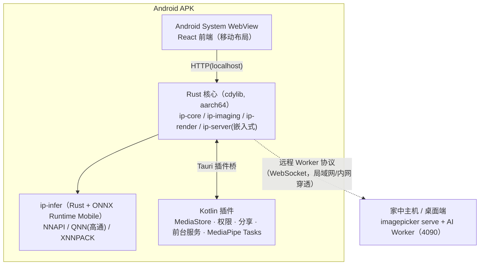

# 08 Android 版本设计

## 1. 定位

手机是很多人最主要的拍照设备。Android 版的目标是：**在手机上直接完成「挑片 + 轻修 + 分享」**，并能与桌面端/家中 GPU 主机协同完成重计算。

| 能力 | 桌面版 | Android 版 |
|---|---|---|
| 浏览、打分、旗标、筛选、对比 | ✅ | ✅（手势优先） |
| 连拍/相似分组、基础评分、闭眼检测 | ✅ | ✅ 端侧（NPU/GPU） |
| 人物聚类 | ✅ | ✅ 端侧（轻量模型） |
| 自动光影色彩、预设、基础调整 | ✅ | ✅ 端侧（GPU 渲染） |
| 磨皮/美白/瘦脸（人脸关键点） | ✅ | ✅ 端侧 |
| 瘦手臂/瘦腿、Best Take、高质量消除、VLM 助手 | ✅ | ☁️ **连接家中主机（远程 Worker）**；端侧提供 LaMa 轻量消除 |
| RAW | ✅ | 仅 DNG + 内嵌预览 |

## 2. 技术方案

**选型：Tauri 2 移动端（Android）**，复用同一份 React 前端与大部分 Rust 核心。



| 层 | Android 方案 | 说明 |
|---|---|---|
| UI | 同一 React 代码 + 移动端布局（响应式断点 < 768px） | 底部导航、全屏滑动挑片、底部抽屉式编辑面板 |
| 核心 | Rust 交叉编译 `aarch64-linux-android`（+ `x86_64` 用于模拟器） | 复用解码、分组、评分合成、编辑栈、SQLite |
| 推理 | **新增 `ip-infer` crate**：Rust `ort`（ONNX Runtime）在端侧直接运行 T0/T1 小模型 | Android 上无法使用 Python Worker；同时桌面端也可用它跑轻模型（ADR-3 的演进方向） |
| 关键点/分割 | MediaPipe Tasks（Kotlin/Android AAR，GPU delegate） | 通过 Tauri 插件暴露给 Rust |
| 渲染 | wgpu（Vulkan 后端）；不支持 Vulkan 的老设备降级 GLES / CPU | 预览代理分辨率 ≤ 2MP |
| 解码 | Android `ImageDecoder` / `BitmapFactory`（硬件 HEIF/JPEG 解码，经插件）+ Rust 兜底 | 利用系统硬件解码器 |
| 相册访问 | MediaStore 查询 + `READ_MEDIA_IMAGES`（Android 13+）/ 部分访问（Android 14 Selected Photos） | 不复制原图；缩略图优先用 `ContentResolver.loadThumbnail` |
| 写操作 | 编辑结果另存为新文件（`Pictures/imagePicker/`）；删除/移入回收站走 `MediaStore.createTrashRequest`（系统确认对话框） | 遵守分区存储 |
| 后台分析 | 前台服务（`dataSync`/`mediaProcessing` 类型）+ 通知进度；充电/空闲时自动分析可选 | 遵守 Android 14+ 前台服务类型要求 |
| 分享 | 系统分享面板（Intent.ACTION_SEND_MULTIPLE） | 直接分享到微信/小红书等 |

最低版本：Android 10（API 29）；推荐 Android 13+、8GB 内存、骁龙 8 Gen 2 / 天玑 9200 及以上获得完整端侧体验。

## 3. 端侧模型（移动档 M）

| 任务 | 模型 | 体积 | 加速 |
|---|---|---|---|
| 人脸检测 + 关键点 + 表情系数 | MediaPipe Face Landmarker | 4MB | GPU |
| 人脸身份 | AuraFace int8 ONNX（或 MobileFaceNet） | 4–60MB | NNAPI/QNN |
| 图文嵌入 | MobileCLIP-S0 / SigLIP2-base int8 | 50–200MB | QNN/XNNPACK |
| 人像分割 | MediaPipe Selfie Multiclass | 16MB | GPU |
| 清晰度/曝光/pHash | 经典算法（Rust） | — | NEON SIMD |
| 消除 | LaMa int8（512px 分块） | ~50MB | GPU/NNAPI |
| 自动调色 | 规则专家系统 + 自适应 3D LUT | <1MB | GPU |

首装 APK ≤ 40MB；模型包（~300MB）首次使用时下载，可选择仅 Wi-Fi。

## 4. 与桌面/主机协同

1. **远程 AI Worker**：在设置中扫码连接家中主机（`imagepicker serve --lan` 显示二维码，含地址与一次性配对令牌）。连接后，Best Take、身体形变、高质量消除、VLM 助手等任务以「缩小图 + 参数」上传到主机执行，返回补丁图层，原图不离开手机（可选择上传原图以获得最高质量）。
2. **会话同步（P2）**：手机上的打分/旗标/编辑栈可同步到桌面端同一批照片（通过 content_key 匹配），实现「手机上粗挑、电脑上精修」。
3. **WebUI 作为备选**：不安装 APK 也可以在手机浏览器访问主机 WebUI（只能处理主机上的照片）。

## 5. 移动端 UX

```
┌─────────────────────┐     ┌─────────────────────┐     ┌─────────────────────┐
│ 京都 2026      🔍 ⋮ │     │ ◀  组 3/23  · 8张   │     │ ◀ 编辑         ✓  │
│ [全部][精选][待定]   │     │                     │     │                     │
│ ▼ 千本鸟居 · 12组    │     │   [ 全屏照片 ]       │     │   [ 预览 ]           │
│ ┌──┐┌──┐┌──┐┌──┐   │     │                     │     │                     │
│ │▣8││  ││▣3││  │   │     │  ← 滑动切换 →        │     │                     │
│ └──┘└──┘└──┘└──┘   │     │  ↑ 精选  ↓ 淘汰      │     ├─────────────────────┤
│ ┌──┐┌──┐┌──┐┌──┐   │     │ ★★★★☆  AI 4.5 ✨     │     │ ✨自动 光影 色彩 美颜 │
│ │  ││▣5││  ││  │   │     │ 😀😀😑 小红闭眼       │     │ 磨皮 ─────●───       │
│ └──┘└──┘└──┘└──┘   │     │ [#1][#2][#3✓][#4]…  │     │ 美白 ───●─────       │
├─────────────────────┤     ├─────────────────────┤     │ 瘦脸 ──●──────       │
│ 🖼图库 ✨挑片 👤人物 ⚙ │     │  [✨全员最佳] [分享]  │     └─────────────────────┘
└─────────────────────┘     └─────────────────────┘
```

- 挑片手势：左右滑切换、上滑精选、下滑淘汰、双击放大、长按多选、星级点击/滑动。
- 「快速挑片模式」：每组只显示 AI Top-3 卡片，Tinder 式左右滑，适合碎片时间。
- 编辑面板为底部抽屉，参数横向滚动选择 + 单滑块调节（类似主流手机修图 App）。
- 震动反馈：精选/淘汰时轻触觉反馈。

## 6. Android 专属风险

| 风险 | 应对 |
|---|---|
| Tauri 2 移动端插件生态尚不成熟 | 关键能力（MediaStore、前台服务、MediaPipe）自写 Kotlin 插件；保持插件层薄 |
| NNAPI 在不同厂商上行为不一致、Android 15 起被标记弃用 | 优先 QNN（高通）/ GPU delegate，XNNPACK CPU 兜底；运行时基准自动选择 |
| WebView 版本差异（WebGL2） | 要求 Android System WebView ≥ 110；大图查看器降级 Canvas2D |
| 端侧发热/耗电 | 分析批量调度、温控降速、仅充电时深度分析选项 |
| 应用商店上架（国内多商店） | 先发 GitHub Release APK + F-Droid（如可能），再评估各商店 |
