# imagePicker 用户指南（简体中文）

> [English version](en.md) · [返回指南首页](README.md) · [项目首页](../../README.md)
>
> 本指南描述**当前已实现**的功能，界面名称与应用内中文文案一致。版本：v0.1（预发布）。
> 文中截图来自 mock 后端的示例图（渐变风景 + 卡通脸），不含真实照片。快捷键中的 `Ctrl` 在 macOS 上对应 `⌘`。

## 目录

1. [概览与界面](#1-概览与界面)
2. [安装](#2-安装)
3. [首次运行与 AI 组件](#3-首次运行与-ai-组件)
4. [导入照片](#4-导入照片)
5. [挑片流程与快捷键](#5-挑片流程与快捷键)
6. [智能分析与星级](#6-智能分析与星级)
7. [分组与堆栈](#7-分组与堆栈)
8. [人物与人脸筛选](#8-人物与人脸筛选)
9. [最佳表情](#9-最佳表情)
10. [编辑](#10-编辑)
11. [人像美化](#11-人像美化)
12. [修复](#12-修复)
13. [导出与预设](#13-导出与预设)
14. [AI 助手](#14-ai-助手)
15. [局域网 WebUI 与访客](#15-局域网-webui-与访客)
16. [隐私与数据位置](#16-隐私与数据位置)
17. [与 Lightroom / darktable 互通（XMP）](#17-与-lightroom--darktable-互通xmp)
18. [设置](#18-设置)
19. [故障排查与常见问题](#19-故障排查与常见问题)
20. [卸载](#20-卸载)

---

## 1. 概览与界面

典型流程：**导入 → 一键分析 → 分组筛选（键盘流）→ 最佳表情 → 修图美化 → 导出**。原图永远不会被修改：所有评分、编辑都保存在本机目录库中（编辑是「编辑栈」，随时可撤销/重置）。

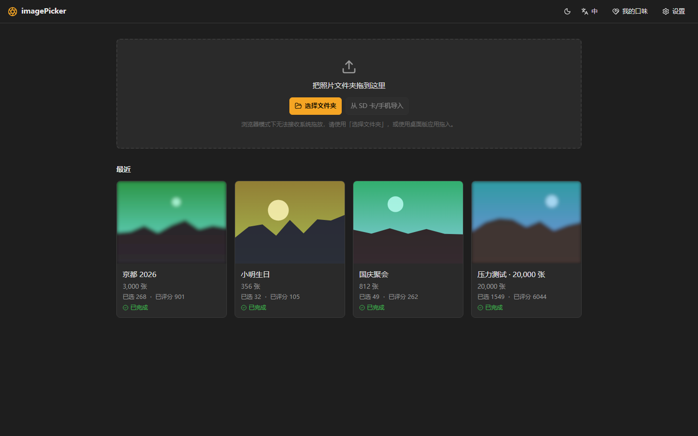

首页：拖入文件夹（桌面版）或点「选择文件夹」导入；「最近」列出已导入的会话。右上角可进入「我的口味」「设置」，切换语言与主题。

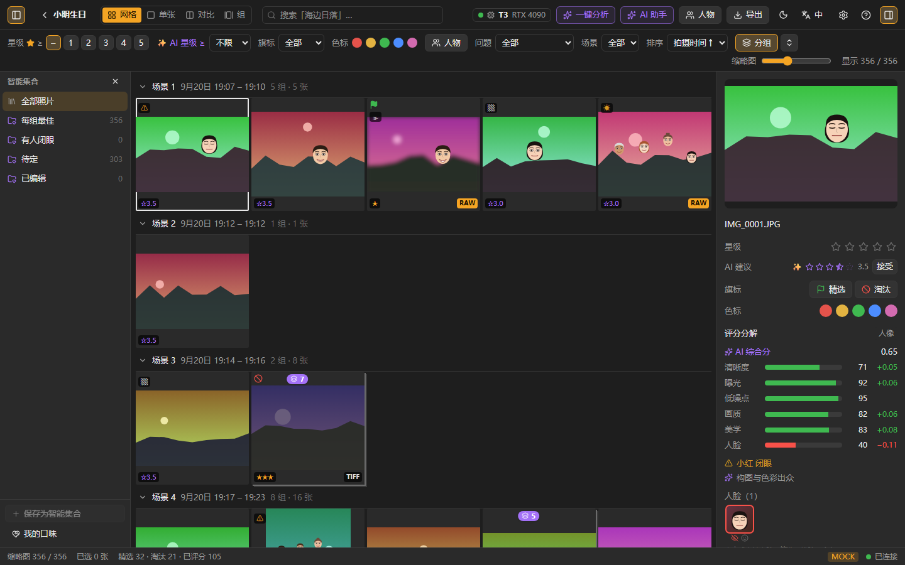

图库主界面：

| 区域 | 说明 |
|---|---|
| 顶栏 | 视图切换：**网格 / 单张 / 对比 / 组**；「一键分析」「AI 助手」「人物」「导出」；AI 引擎状态（档位与显卡） |
| 筛选栏 | 星级、AI 星级、旗标、色标、人物、问题、场景、排序、缩略图大小、「分组」开关 |
| 左侧「智能集合」 | 内置：每组最佳、有人闭眼、待定、已编辑；可把当前筛选保存为自己的集合 |
| 网格 | 按场景分段；连拍折叠为堆栈（角标显示张数）；缩略图上显示星级、旗标与问题图标 |
| 右侧检查器 | 评分分解、AI 建议星级（可「接受」）、旗标、色标、人脸、EXIF（`Tab` 隐藏/显示） |
| 底部状态栏 | 缩略图进度、已选数量、精选/淘汰/已评分统计、连接状态 |

> 顶栏的搜索框（自然语言搜索）目前是灰色占位，尚未提供。

## 2. 安装

> 安装包将发布在 [GitHub Releases](https://github.com/harveyxiacn/imagePicker/releases)。在发布之前（以及想要最新代码时）请按下面「从源码构建」。

### 系统要求

| | 最低 | 推荐 |
|---|---|---|
| 系统 | Windows 10/11（需 WebView2，Win11 自带）、macOS、Linux（含 CachyOS / Arch） | — |
| 内存 | 8 GB | 16 GB+ |
| 显卡 | 不需要（CPU 可用） | NVIDIA 8 GB+ 显存（T2+）；见[硬件档位](../../README.md#硬件档位) |
| 磁盘 | 约 0.5 GB（基础模型）起；标准档约 2 GB；全部增强包可达数十 GB | SSD |

### Windows

1. 下载 `imagePicker_<版本>_x64-setup.exe`（NSIS 安装程序；企业部署可用 `.msi`）并运行。
2. 安装包**暂未进行代码签名**，Windows SmartScreen 可能提示「Windows 已保护你的电脑」：点「更多信息 → 仍要运行」。可用 Releases 页的 `SHA256SUMS.txt` 核对文件（PowerShell：`Get-FileHash .\imagePicker_*_x64-setup.exe`）。
3. 若系统缺少 WebView2，请先安装 [Microsoft Edge WebView2 Runtime](https://developer.microsoft.com/microsoft-edge/webview2/)。

### macOS

下载 `.dmg`（通用版，Intel 与 Apple 芯片均可），把应用拖入「应用程序」。应用**暂未签名/公证**，首次打开会被 Gatekeeper 拦截：在 Finder 中**右键 → 打开 → 打开**，或在「系统设置 → 隐私与安全性」中点「仍要打开」；也可在终端执行 `xattr -dr com.apple.quarantine /Applications/imagePicker.app`。

### Linux（含 CachyOS / Arch）

下载 `.AppImage`（赋予可执行权限后运行）或 `.deb`。从源码构建需要 WebKitGTK 等依赖：

```sh
# Debian / Ubuntu
sudo apt install libwebkit2gtk-4.1-dev libayatana-appindicator3-dev librsvg2-dev libgtk-3-dev patchelf
# Arch / CachyOS（包名请以你的仓库为准）
sudo pacman -S webkit2gtk-4.1 gtk3 libayatana-appindicator librsvg patchelf
```

### 从源码构建

需要 Rust、Node 24、pnpm 10：

```sh
cd web && pnpm install
cd ../apps/desktop && pnpm install
pnpm tauri build                 # 生成当前系统的安装包
```

更多选项见 [apps/desktop/README.md](../../apps/desktop/README.md)。

### 只用浏览器（WebUI）

```sh
cd web && pnpm install && pnpm build && cd ..
cargo run -p ip-cli -- serve --web-dir web/dist        # 默认 http://127.0.0.1:7878
```

浏览器版无法接收系统拖放，请用「选择文件夹」；其余功能与桌面版相同。

## 3. 首次运行与 AI 组件

首次进入首页时会出现欢迎卡片，显示检测到的显卡、推荐档位和需要下载的大小：

- **先用基础功能**：不下载任何东西，立即开始导入、打星、挑片；
- **下载 AI 组件**：后台下载推荐模型，不阻塞使用，也可以稍后在「设置 → 硬件与模型」下载。

之后会有三步气泡引导（一键分析、堆栈、数字键打分）。

### AI 组件（Python 工作进程）

分析、AI 蒙版、人像、修复、本地助手模型由独立的 Python 进程（`ai-worker`）提供。**安装包已内置安装器，无需自己装 Python**：

1. 在欢迎卡片点「下载 AI 组件」，或打开「设置 → 硬件与模型 → AI 组件」点「安装」。
2. 应用会把私有 Python 3.12 与 AI 组件装进数据目录下的 `runtime/`（不影响系统里的 Python），并按硬件自动选择版本：NVIDIA 显卡且驱动 ≥ 580 时安装 CUDA 版，其他情况安装 CPU 版。
3. 需要联网下载约 1–2.5 GB（视网速 2–5 分钟），可随时取消；装好后约占 2.3 GB。之后再按需下载模型。
4. 应用升级后会提示重新安装对应版本；可在同一页「移除」以释放空间。

关闭「设置 → 人脸与隐私 → 允许联网」时不会安装。任何需要 AI 的操作在未安装时都会弹出「安装 AI 组件」提示。

> 顶栏的「AI 引擎」状态点会显示 就绪 / 启动中 / 工作中 / 已崩溃 / 不可用。

**从源码运行（开发者）**：桌面开发模式会直接使用仓库里的 `ai-worker/`（需要 [uv](https://docs.astral.sh/uv/)）：

```sh
cd ai-worker
uv sync --extra cuda --extra mediapipe     # NVIDIA 显卡（驱动 ≥ 580）
uv sync --extra cpu  --extra mediapipe     # 仅 CPU
# 可选：本地 AI 助手模型  --extra llm-cuda（配 cuda） / --extra llm（配 cpu）
```

可用环境变量：`IMAGEPICKER_WORKER_DIR`（工作进程目录）、`IMAGEPICKER_WORKER_CMD`（自定义启动命令）、`IMAGEPICKER_MODELS_DIR`（模型目录）。

### 模型下载

第一次用到某项 AI 功能时会弹出「需要下载 AI 模型」对话框，列出模型、用途、大小与许可证：

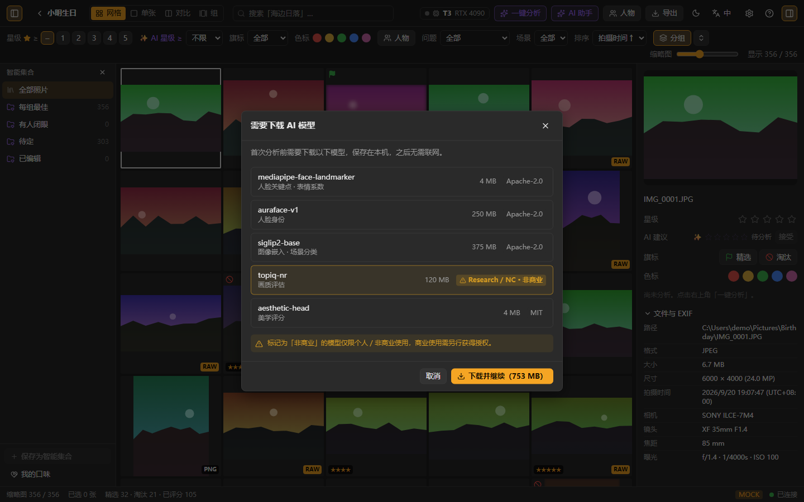

- 点「下载并继续」开始下载，也可「转入后台」；
- 标有「非商业」的模型仅限个人使用；
- 下载源：自动（失败时切换镜像）/ Hugging Face / HF 镜像 / ModelScope（魔搭），在「设置 → 硬件与模型」选择；
- 模型保存在本机，之后无需联网；在设置里可删除模型释放空间。

## 4. 导入照片

- **桌面版**：把文件夹拖进首页，或点「选择文件夹」（原生选择器）。
- **浏览器 / 手机**：点「选择文件夹」，使用应用内的文件夹浏览器（只能访问「允许访问的文件夹」，见[设置](#18-设置)）。
- 支持：JPEG、PNG、WebP、AVIF、TIFF、各品牌 RAW（CR2/CR3、NEF、ARW、RAF、ORF、RW2、DNG 等）与 HEIC/HEIF 文件。RAW 取内嵌预览生成缩略图。
- 导入会递归扫描子文件夹，状态依次为「扫描中…」→「生成缩略图…」→「已完成」，缩略图出现的同时就可以开始浏览和打星。
- 「移除会话」只删除目录库记录与缓存，**不会删除原图**。
- 「从 SD 卡/手机导入」按钮目前不可用（灰色）。

HEIC/HEIF（手机照片）需要解码器，依次尝试：文件内的 JPEG 预览 → 系统解码器（Windows 需在 Microsoft Store 安装「HEIF 图像扩展」与「HEVC 视频扩展」；macOS 自带）→ libheif（Linux 安装 `libheif` 及其 HEVC 插件；已安装 AI 组件时自动使用其中自带的 libheif）。都没有时这些照片没有缩略图，见[常见问题](#19-故障排查与常见问题)。

已知限制：RAW 预览仅用合成样本验证过，欢迎反馈真实相机文件的表现。

## 5. 挑片流程与快捷键

推荐的键盘流：`←/→` 浏览 → `1`–`5` 打星（`Shift+数字` 打星并跳到下一张）→ `P` 精选 / `X` 淘汰 → `S` 展开堆栈 → `B` 进组视图挑最佳 → `D` 修图。

点击选中一张，`Ctrl+点击` 多选，`Ctrl+A` 全选；评分、旗标、色标对**所有选中的照片**生效。`?` 随时打开快捷键面板（由键位表生成，与下表一致）。

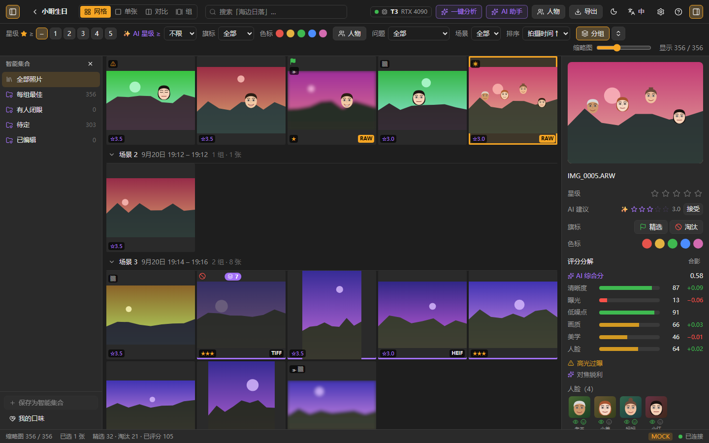

### 视图与导航

| 快捷键 | 动作 | 作用范围 |
|---|---|---|
| `←` `→` | 上一张 / 下一张 | 网格、单张、对比、组 |
| `↑` `↓` | 上一行 / 下一行 | 网格 |
| `Home` `End` | 第一张 / 最后一张 | 网格、单张、对比、组 |
| `Enter` / `Space` | 打开单张视图 | 网格 |
| `Esc` | 返回网格 / 清除选择 | 网格、单张、对比、组 |
| `G` `E` `C` `B` | 网格 / 单张 / 对比 / 组视图 | 除编辑页 |
| `F` | 全屏 | 除编辑页 |
| `Tab` | 隐藏/显示检查器（网格、单张）；交换 A/B（对比、组） | |
| `S`（对比、组） | 同步缩放开关 | 对比、组 |
| `Space` | 适应 / 100% 切换 | 单张、对比、组 |
| 按住 `Z` | 100% 放大镜 | 单张、对比、组 |
| `Shift+F` | 显示/隐藏人脸框 | 单张、对比、组 |

### 评分与标记

| 快捷键 | 动作 |
|---|---|
| `0`–`5` | 设置星级（`0` 清除） |
| `Shift+0`–`Shift+5` | 评分并跳到下一张 |
| `P` / `X` / `U` | 精选 / 淘汰 / 取消旗标 |
| `6` `7` `8` `9` | 色标：红 / 黄 / 绿 / 蓝 |
| `A` | 接受 AI 星级（当前或所选） |
| `Ctrl+Shift+A` | 接受全部 AI 星级（需确认，可 `Ctrl+Z` 一步撤销，会覆盖已有星级） |

> 星级与旗标相互独立：**精选/淘汰是旗标**，星级是 0–5。淘汰只是标记，不会删除文件。**用户星级永远优先于 AI 星级**，两者分开保存。

### 堆栈、组与筛选

| 快捷键 | 动作 | 范围 |
|---|---|---|
| `S` / `Shift+S` | 展开/折叠当前堆栈 / 全部堆栈 | 网格 |
| `,` `.` | 上一组 / 下一组 | 网格、组 |
| `Enter` / `Shift+Enter` | 精选 A / 精选 A 并跳到下一组 | 组 |
| `Shift+P` | 人物筛选器 | 除编辑页 |
| `Ctrl+J` | 唤起 AI 助手 | 全部（含编辑页） |
| `Ctrl+E` | 导出 | 全部（含编辑页） |
| `?` | 快捷键帮助 | 全部（含编辑页） |

**设备筛选。** 当一个会话包含多台相机/手机（或有缺少相机 EXIF 的照片）时，筛选栏会出现「设备」按钮：勾选一个或多个设备（带类型图标：手机、相机、无人机、运动相机）或「无相机信息」即可缩小范围，按钮上显示已选数量，「清除筛选」会一并重置。检查器中相机名称旁也会显示同样的类型图标。

### 编辑页快捷键

| 快捷键 | 动作 |
|---|---|
| `D` / `Esc` | 返回图库 |
| `\` | 前后对比（显示原图） |
| `O` | 蒙版叠加开/关 |
| `R` | 裁剪模式 |
| `Shift+E` | 画笔消除工具 |
| `Ctrl+Shift+C` / `Ctrl+Shift+V` | 复制 / 粘贴设置 |
| `Ctrl+Z` / `Ctrl+Shift+Z`（或 `Ctrl+Y`） | 撤销 / 重做 |

### 触控（WebUI）

单张视图：左右滑动切换上/下一张；双击在「适应」与 100% 之间切换；滚轮以光标为中心缩放，拖动平移。

## 6. 智能分析与星级

点顶栏的 **一键分析**，选择档位后「开始分析」：

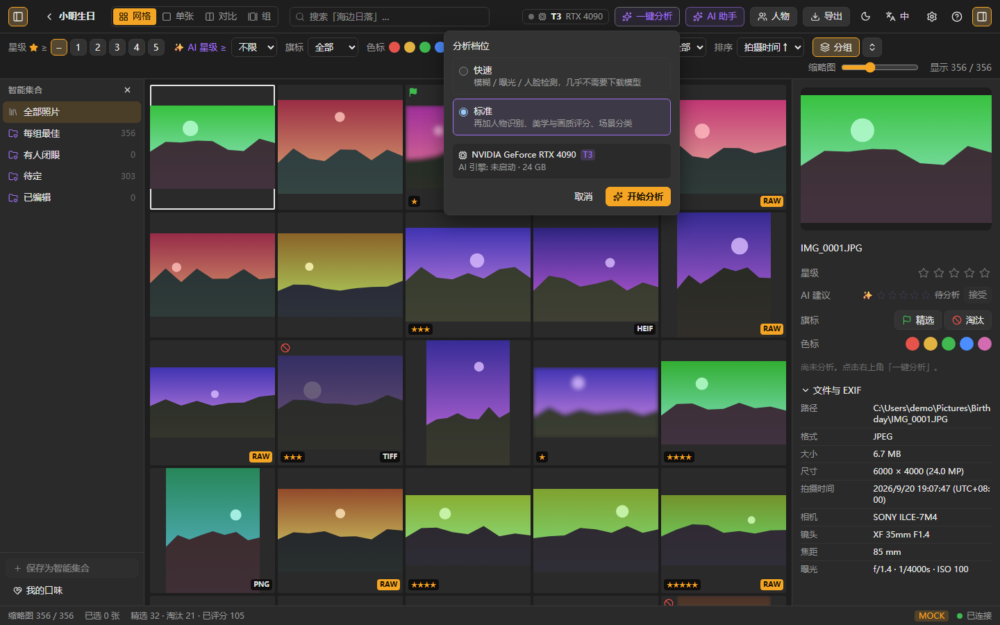

| 档位 | 内容 | 模型 |
|---|---|---|
| **快速** | 模糊 / 曝光 / 人脸检测 | 几乎不需要下载 |
| **标准**（默认） | 再加人物识别、美学与画质评分、场景分类 | 需要下载约 2 GB（视档位） |

- 可只分析所选照片（「仅分析所选 N 张」）；
- 进度依次为：分析照片 → 连拍分组 → 综合评分 → 人物聚类；
- 可在「设置 → 分析」设置默认档位、**导入后自动分析**、连拍分组严格度（宽松/标准/严格）。

### AI 星级与评分分解

分析后每张照片得到 AI 建议星级（0–5，可带半星）和一个 0–1 的综合分。检查器的「评分分解」列出各项分数及其对综合分的贡献：

| 维度 | 含义 |
|---|---|
| 清晰度 / 曝光 / 低噪点 | 技术指标 |
| 画质 / 美学 | 模型评估 |
| 人脸 | 是否睁眼、笑容、看镜头 |
| 构图 | （尚未启用，见下） |

并给出可读的理由，如「小红 闭眼」「对焦锐利」「4 张连拍中的最佳」。问题标签有：有人闭眼、模糊、过曝、欠曝、噪点多、倾斜（倾斜检测尚未实现）。

- 点检查器里的「接受」，或按 `A`，把 AI 星级写为**你的**星级；`Ctrl+Shift+A` 批量接受。
- 筛选栏的「AI 星级」按建议星级过滤。

### 我的口味

首页的「我的口味」会根据你的评分、旗标和同组取舍学习偏好，把基础评分与你的口味按权重 α（0–0.6）混合。只有在保留集上验证优于基础评分才会启用；所有数据只在本机，可随时重置。

> **诚实提示**：问题标签的阈值已在 1000 张合成评测图上校准，尚未在大规模真实照片上校准。保留细节的亮图或暗图（白底人像、白纸文档、夜晚霓虹街景）不再标记为过曝或欠曝；连拍组内明显比最清晰一张更糊的照片会标记为「模糊」。背景虚化的人像仍可能被误标为模糊。请把 AI 星级当作建议。

## 7. 分组与堆栈

分析会把照片分为 **场景**（分钟级、同一地点/主题）和其中的 **连拍组**（秒级、画面高度相似）。网格中：

- 每个场景一个标题（「场景 N · X 组 · Y 张」）；
- 连拍组折叠成**堆栈**，只显示最好的一张，角标显示张数。点角标或按 `S` 展开，`Shift+S` 展开/折叠全部；
- 筛选栏的「分组 / 平铺」开关切换是否按场景/堆栈显示。

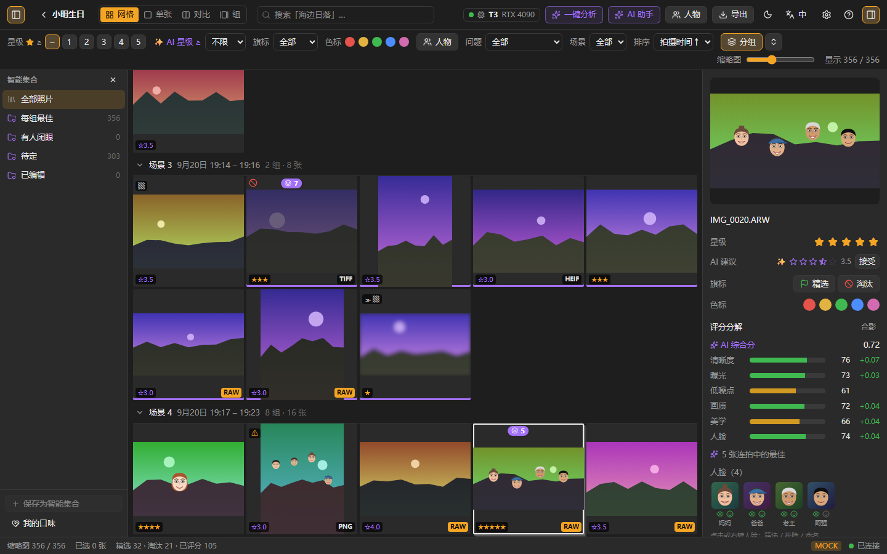

### 组视图

选中一个堆栈里的照片，按 `B` 进入组视图：

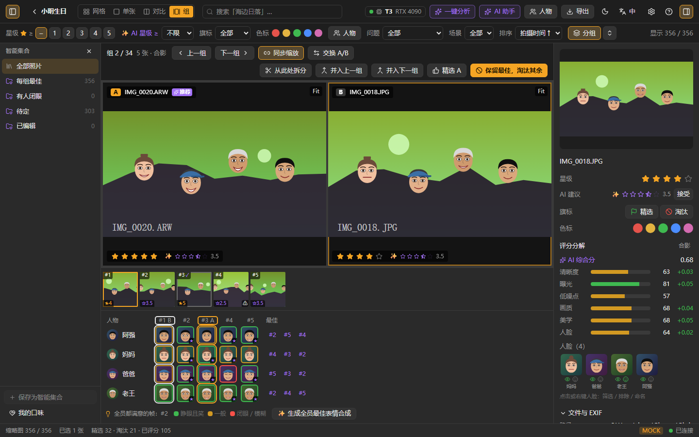

- **A / B 对比**：A 是左侧底片（带「推荐」标记），B 是右侧对比对象；`Tab` 交换，`S` 同步缩放与平移；下方缩略条切换 B；
- **精选 A**（`Enter`）、**保留最佳，淘汰其余**（把 A 设为精选，组内其他标淘汰，可撤销）；
- **从此处拆分**（把 B 及之后拆为新组）、**并入上一组 / 下一组**——AI 分组不对时手动修正；
- `,` / `.` 上一组 / 下一组，`Shift+Enter` 精选 A 并跳到下一组；
- **表情矩阵**：行是人物，列是帧，颜色表示表情（绿色：睁眼且笑，黄：一般，红：闭眼/模糊），「最佳」列给出每人最佳的帧；下方提示「全员都满意的帧」，若没有则可「生成全员最佳表情合成」。

## 8. 人物与人脸筛选

分析后，人脸在本机聚类成**人物**（用 AuraFace 身份特征）。

- **人物页**（顶栏「人物」）：卡片显示每个人和张数。可「重命名」、「隐藏人物」、勾选多位后「合并所选」，或「查看同框照片」（至少两位）。

  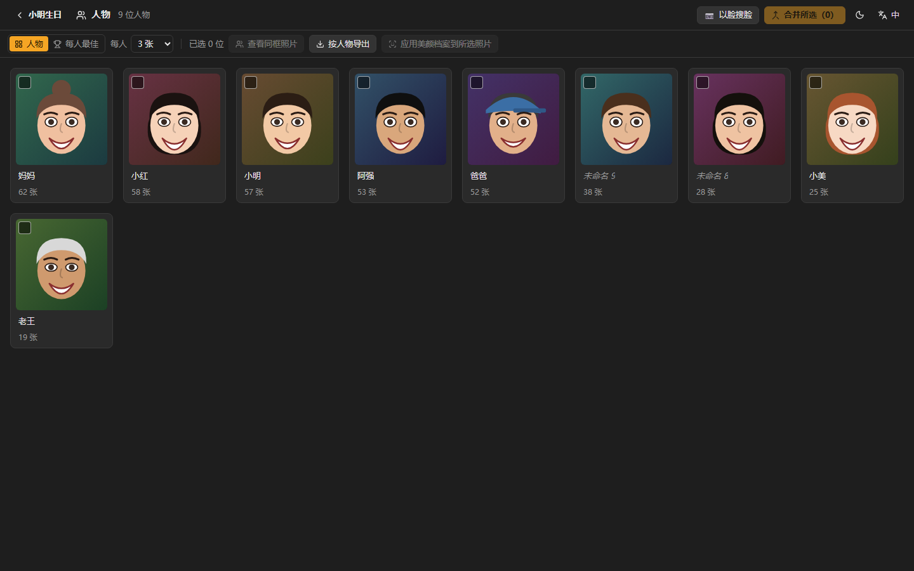

- **每人最佳**：切换到「每人最佳」视图，每人展示 N 张最佳照片（每人 1/3/5…张）。
- **按人物导出**：把所选人物的照片导出到每人一个文件夹。
- **以脸搜脸**：拖入或粘贴（`Ctrl+V`）一张外部照片（JPG/PNG/WebP），在库里找同一个人；图片只在本机处理。结果列出可能的人物（点击即筛选）和相似人脸。
- **这是新的人**：如果候选里没有这个人，或者 AI 把两个人混在了一起，在以脸搜脸结果的相似人脸里勾选属于这个人的脸（相似度高的已预先勾选；同一张照片只能选一张脸），点「这是新的人」，可顺手起个名字。这些脸会离开原来的人物，归入新人物并被锁定，以后重新分析也不会被改回。
- **在照片上操作**：开启人脸框（`Shift+F`）后，点击或右键人脸：筛选有此人的照片 / 排除此人 / 命名 / 「不是此人」（拆分为新的人物）/ 「查找相似的脸」（以这张脸搜索，可把相似的脸一起归为新的人）。

### 人物筛选器（`Shift+P`）

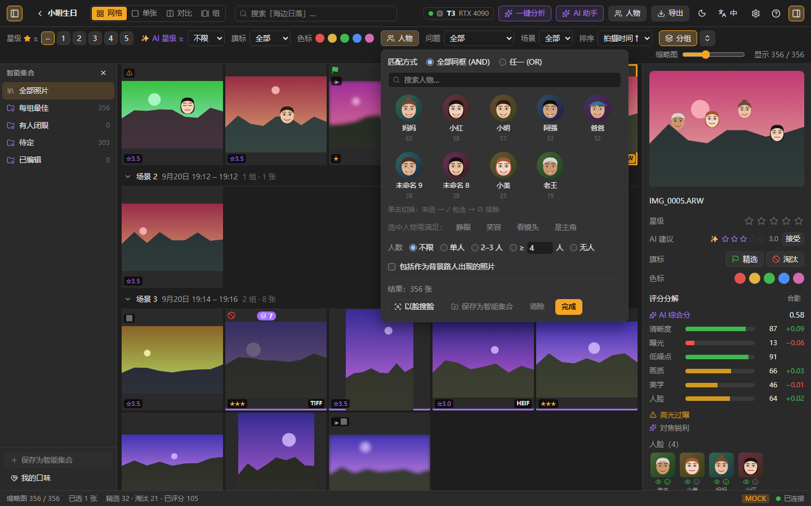

单击人物依次切换：**未选 → 包含 → 排除**。匹配方式可选「全部同框 (AND)」或「任一 (OR)」；还可要求选中人物「睁眼 / 笑容 / 看镜头 / 是主角」，限定人数（单人、2–3 人、多人、无人），以及是否包括作为背景路人出现的照片。结果实时显示张数；「保存为智能集合」可保存这组条件。

> 关闭人脸识别：「设置 → 人脸与隐私」。关闭后不再检测与聚类人脸，人物、最佳表情与美颜档案相关功能不可用。

## 9. 最佳表情

合影里总有人闭眼？在组视图点表情矩阵下方的 **生成全员最佳表情合成**（或在「修复」面板点「最佳表情（本组连拍）…」）进入编辑器：

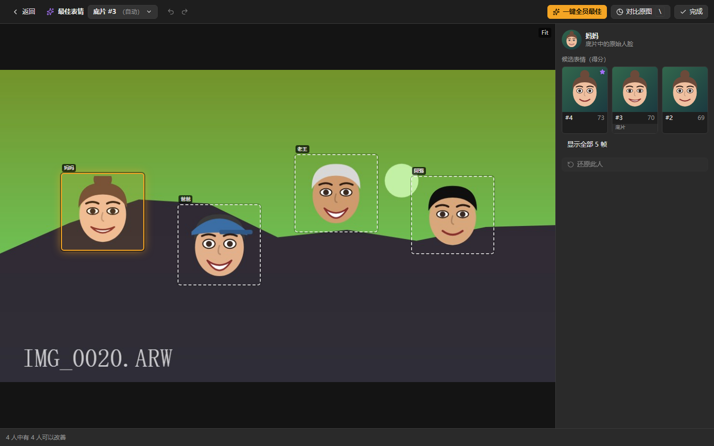

1. 顶部选择**底片**（默认自动选择最合适的一帧：需要替换的脸最少、最小，没人缺席，且不模糊、曝光正常；组内最佳只在别的帧明显更省事时才让位。鼠标悬停底片按钮可看选择原因，下拉列表中每帧显示需替换几张脸）；
2. **一键全员最佳**：在自动底片上为每个能明显改善的人选最佳且可合成的表情（表情分提升不足 4 分的不替换，减少合成痕迹）；也可在已选底片上执行「在此底片上全员最佳」；
3. 或手动：点画面中的人脸，右侧列出该人的**候选表情（得分）**，点选一张即贴到底片上；「底片」项即还原；
4. 「融合强度」「边缘羽化」微调；「对比原图」（`\`）；「还原此人」；
5. 点「完成」回到图库。结果是编辑栈中的一个生成图层，可撤销，原图不变。

不能合成的候选会置灰并说明原因（头部转动过大、人脸被遮挡、人脸太小、未找到人脸）；相机移动、遮挡或接缝可能会给出提醒。

> 已知限制：自动选底片只看表情分、人脸大小、缺席人物与模糊/曝光问题，相机移动要到合成时才检测；需要 AI 组件及其模型（人脸关键点、人像分割、BiRefNet）。

## 10. 编辑

在网格/单张按 `D`（或右键「编辑」）进入编辑页；所有调整是**非破坏性**的，自动保存（顶部显示「已保存」）。底部胶片条可切换照片，`D` / `Esc` 返回。

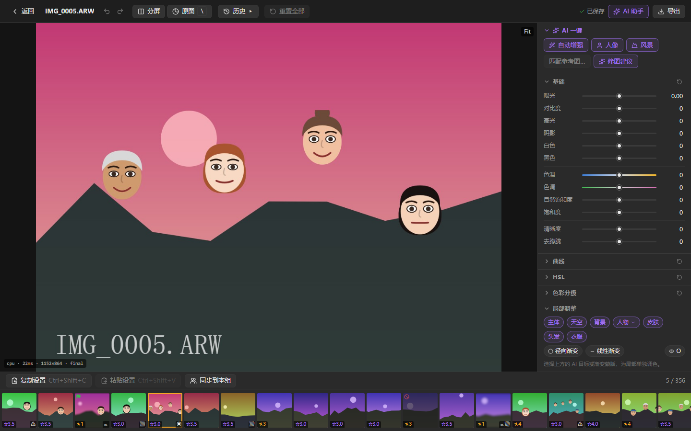

### AI 一键

「AI 一键」提供 **自动增强 / 人像 / 风景**，并可「匹配参考图…」；**修图建议**（需要本地 VLM，T2+）会给出调整建议和理由，点「一键应用」应用（可撤销）。

### 基础与色彩

| 面板 | 内容 |
|---|---|
| **基础** | 曝光、对比度、高光、阴影、白色、黑色、色温、色调、自然饱和度、饱和度、清晰度、去朦胧 |
| **曲线** | 点击添加控制点，拖动调整，双击或右键删除 |
| **HSL** | 8 个色相带（红/橙/黄/绿/浅绿/蓝/紫/洋红）的色相、饱和度、明度 |
| **色彩分级** | 阴影 / 中间调 / 高光三色轮 + 平衡 |
| **裁剪与拉直**（`R`） | 比例（原始/自由/…）、角度 |
| **预设** | 内置预设（自然、日系清新、电影感、经典黑白、柔和人像、风景鲜明、暖/冷调胶片、鲜艳、哑光、高对比黑白、青橙、黄金时刻…），可「存为预设」 |
| **LUT** | 内置 LUT；也可导入自己的 `.cube` 文件（填写文件路径，需在允许访问的文件夹内），带「数量」滑块 |
| **输出锐化** | 导出前的锐化 |

每节右上角可「重置本节」；顶部「重置全部」；「历史」列出每一步操作。

### 局部调整与蒙版

在「局部调整」选择 **AI 目标**：主体、天空、背景、人物（可指定某个人或任意人物）、皮肤、头发、衣服；或添加 **径向渐变 / 线性渐变**（画面上拖动手柄）。每个局部有自己的曝光、对比度、高光、阴影、色温、饱和度、清晰度、去朦胧，以及数量、反转、羽化。`O` 切换蒙版叠加。

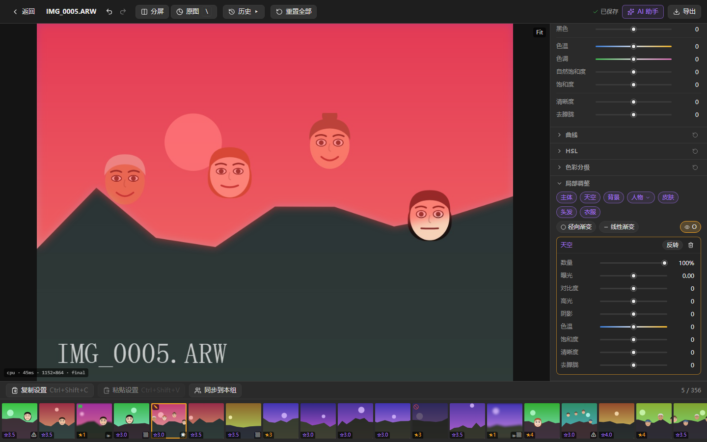

首次使用 AI 蒙版需下载分割模型。天空蒙版在没有模型时会退化为颜色/亮度启发式。

### 前后对比、复制粘贴、同步

- `\` 临时显示原图；顶部「分屏」做分屏对比；
- **复制设置**（`Ctrl+Shift+C`，可选类别：裁剪、全局、局部、LUT、输出锐化）→ **粘贴设置**（`Ctrl+Shift+V`，在网格里多选后可粘贴到所有选中）；
- **同步到本组**：把当前调整同步到同组（连拍）照片，并按曝光/白平衡差异自适应微调。

## 11. 人像美化

在编辑页展开 **人像美化**。首次点「准备人像数据」（需要下载人脸关键点、姿态、皮肤/人体蒙版模型，每张照片只算一次）。

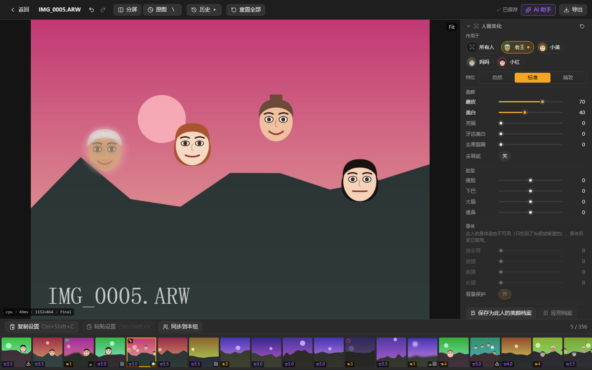

1. 「作用于」选择**所有人**或某一位具体人物（按人物单独设置）；
2. **档位**：自然 / 标准 / 精致；
3. 滑块：
   - 美颜：磨皮、美白、亮眼、牙齿美白、去黑眼圈、去瑕疵（开/关）
   - 脸型：瘦脸、下巴、大眼、瘦鼻
   - 身体：瘦手臂、瘦腿、瘦腰、长腿（需要检测到身体姿态；只拍到头部或被遮挡时自动禁用）
   - 背景保护：身体形变时保护背景（默认开）；
4. 「精致」档配合较高数值会提示可能显得过度修饰；
5. **保存为此人的美颜档案**，之后可在同一个人出现的任何照片上「应用档案」，也能对多选照片批量「应用美颜档案」。

> 已知限制：形变/美颜强度是在合成人像上标定的，真实人脸效果请自行判断；身体形变后的背景补全尚未提供。

## 12. 修复

编辑页的 **修复** 面板：

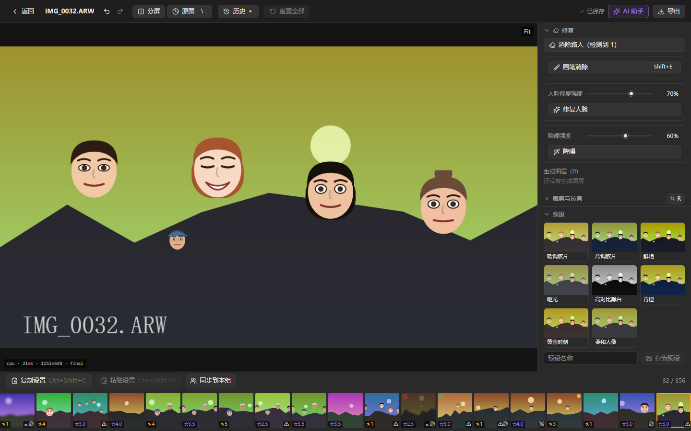

| 工具 | 用法 |
|---|---|
| **消除路人（检测到 N）** | 悬停可在画面上圈出被判定为路人的人脸，点击即消除（需确认后才执行） |
| **画笔消除**（`Shift+E`） | 涂抹要移除的内容；按住空格或鼠标中键拖动画面，`Enter` 应用；可撤销上一笔/清除笔画；可调画笔大小 |
| **修复人脸** | 调整「人脸修复强度」后运行（GFPGAN）；小于 48 px 的脸会被跳过 |
| **降噪** | 调整「降噪强度」后运行 |
| **生成图层** | 每次生成的结果是一个图层，可隐藏/显示/删除，并保存在编辑栈里 |

生成任务有进度条；失败会提示重试。超分放大在[导出](#13-导出与预设)时选择。

> 已知限制：超过 512 px 的大面积消除结果偏糊或有残影；雕像/海报上的人脸可能被当作「路人」，所以消除前需要你确认；生成任务目前不能取消。

## 13. 导出与预设

按 `Ctrl+E`（或顶栏「导出」）：

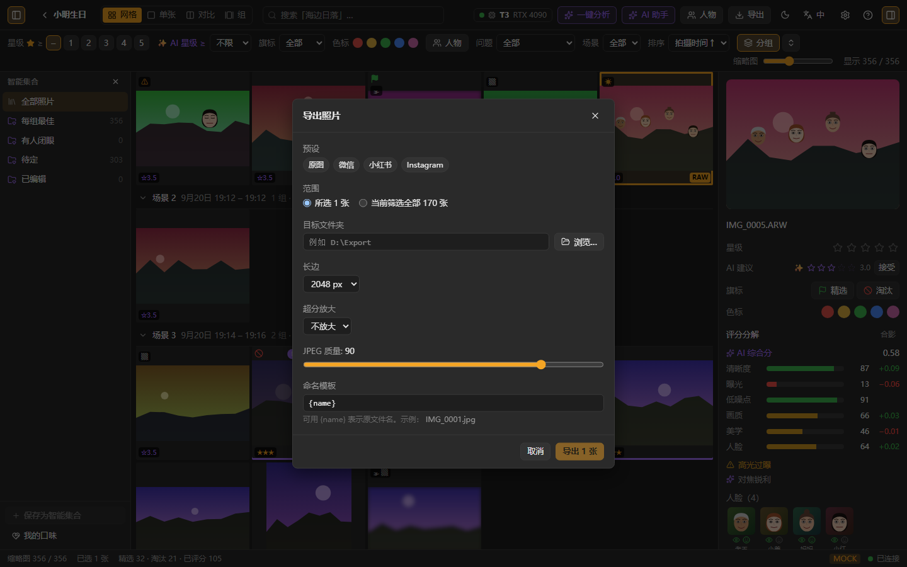

| 选项 | 说明 |
|---|---|
| **预设** | 原图（原始尺寸、质量 95）、微信（长边 1920、质量 82）、小红书（1440、88）、Instagram（1080、90） |
| 范围 | 所选 N 张 / 当前筛选全部 |
| 目标文件夹 | 可手动输入或「浏览…」（须在允许访问的文件夹内） |
| 长边 | 原始尺寸 / 自定义像素 |
| JPEG 质量 | 默认 90 |
| 命名模板 | `{name}` 表示原文件名，下方实时示例 |
| 超分放大 | 不放大 / ×2 / ×4（CPU 档每张可能数十秒） |
| 按人物分文件夹导出 | 在人物页使用 |

导出包含你在编辑页的所有调整，输出为 JPEG，并带上原图的元数据：EXIF（RAW、TIFF 也会复制原始 EXIF，厂商私有的 MakerNote 除外）、XMP（评分、关键词、标题、作者等；只描述原图的条目，如朝向、Lightroom/darktable 的冲印参数，不会带过去）和 IPTC。带广色域配置文件（Display P3、Adobe RGB）的照片会转换为 sRGB（缩略图与预览同样转换），每张导出都嵌入 sRGB ICC。API 选项 `strip_gps` 会同时删除 EXIF 和 XMP 中的 GPS 位置。原尺寸且未编辑的导出是原文件的原样复制。

> 已知限制：HEIC/HEIF 照片要有可用的 HEIF 解码器才能重新编码导出（与缩略图相同，见[导入照片](#4-导入照片)），HDR（PQ / HLG）内容不做色调映射；DNG/CR3 文件内部的 XMP 与扩展 XMP（超过 64 KB，如景深图）不复制（`.xmp` 侧车文件会复制）；旧版本生成的缩略图在清除缓存（「设置 → 缓存」）前保持原来的颜色。

## 14. AI 助手

按 `Ctrl+J` 或点顶栏「AI 助手」打开抽屉。用自然语言（中文或英文）下达指令，助手**先给出计划**，你点「预览影响」查看会改动哪些照片，再点「执行」。涉及淘汰、批量改星、导出的步骤带「需确认」标记，需要二次确认；不会删除任何原图；执行后可点「撤销整次执行」（或 `Ctrl+Z`）一步还原。

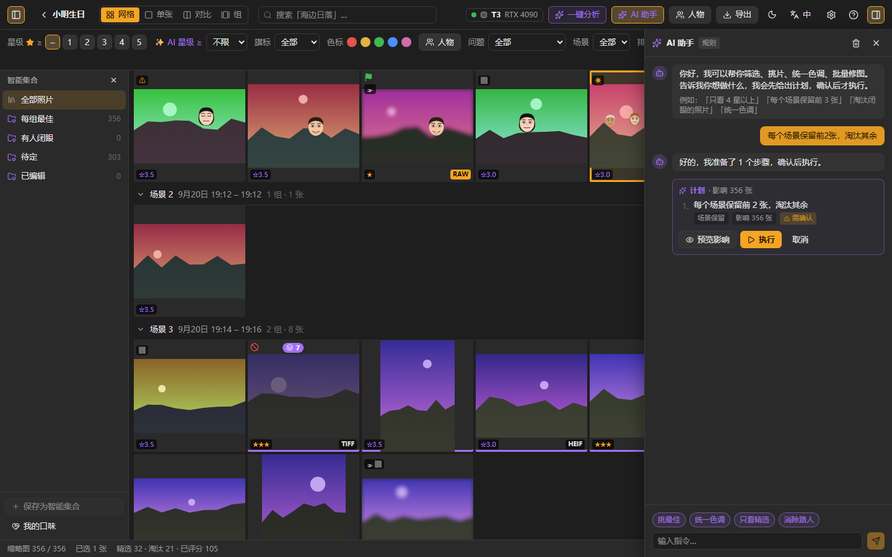

指令示例（均可直接使用）：

| 你想做的 | 示例指令 |
|---|---|
| 筛选（立即生效，不改数据） | 「只看 4 星以上」「只看小明的照片」「只看精选」 |
| 评分 / 旗标 | 「给所有照片打 3 星」「把闭眼的照片都淘汰」「所有照片接受 AI 评分」 |
| 每组/每场景保留 | 「每个场景只留 2 张，其他淘汰」「把前 2 张最好的评 5 星」「挑出每组最佳」 |
| 修图 | 「一键修图」「统一色调」「给所有照片应用胶片暖调」 |
| 人像与最佳表情 | 「应用美颜档案」「全员最佳表情」 |
| 修复 | 「消除路人」 |
| 导出 | 「导出精选到小红书尺寸」 |
| 描述 / 建议（需要本地 VLM，T2+） | 「给我一些修图建议」 |

English works too: "only show Alice's photos rated 4 stars or more", "keep 2 per scene and reject the rest", "reject all photos with closed eyes", "export the picks for Instagram".

输入框下方的快捷按钮：挑最佳、统一色调、只看精选、消除路人。

**引擎**：标题旁的徽章显示当前引擎。

| 引擎 | 说明 |
|---|---|
| 规则 | 中英文意图模板，离线可用，所有档位都有 |
| 本地模型 | 需要安装助手模型（T2+，见 AI 组件的 `llm` 选项）；模型只负责生成计划，工具与参数经校验后才会执行 |

在「设置 → 硬件与模型 → 助手引擎」选择 自动 / 仅规则 / 本地模型。无法理解的指令会提示原因并给出示例。

命令行也能试：`imagepicker ask --session <id> "只看 4 星以上"`（加 `--execute` 才会执行）。

## 15. 局域网 WebUI 与访客

让同一网络里的手机、平板用浏览器访问照片库（例如家里 4090 主机跑服务，笔记本/平板访问）。

1. 「设置 → 局域网 / WebUI」：先设置**所有者密码**（首次只能在本机设置；至少 8 位）。可选：设置**访客密码**（不能与所有者相同）并勾选「允许只读访客」；
2. 打开「开启局域网访问」，端口默认 7878（1024–65535；更改端口需要重启后生效）；
3. 页面会列出访问地址和二维码；同网络设备打开链接或扫码，输入密码登录。

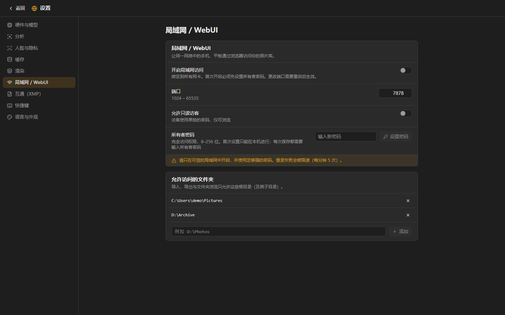

| 角色 | 权限 |
|---|---|
| 所有者 | 完全访问 |
| 只读访客 | 只能浏览：不能评分、编辑、导出，看不到人物与人脸数据 |

安全说明：只在可信的局域网中开启并使用足够强的密码；登录失败每分钟最多 5 次；远程设备只能访问「允许访问的文件夹」；请求来源受限。命令行：`imagepicker serve --lan`（密码也可通过环境变量 `IMAGEPICKER_PASSWORD` 提供，避免出现在命令行里）。

## 16. 隐私与数据位置

- 照片、人脸特征、评分和编辑**只保存在本机**，不会上传。
- 唯一的联网行为是按需下载模型（以及你主动使用的镜像）。「设置 → 人脸与隐私 → 允许联网」关闭后不进行任何下载，应用完全离线运行。
- 人脸识别可在设置里整体关闭；「清除全部人脸数据」会删除所有人脸、人物与美颜档案（不影响照片与评分），需要输入「清除」确认。
- 局域网访问默认关闭；密码以 Argon2id 哈希存储。

### 数据位置

默认数据目录（可用 `IMAGEPICKER_DATA_DIR` 或 `--data-dir` 改变）：

| 系统 | 路径 |
|---|---|
| Windows | `%APPDATA%\imagePicker` |
| macOS | `~/Library/Application Support/imagePicker` |
| Linux | `$XDG_DATA_HOME/imagePicker`（通常 `~/.local/share/imagePicker`） |

| 内容 | 位置（相对数据目录） |
|---|---|
| 目录库（评分、旗标、编辑、人物） | `catalog.db` |
| 缩略图 / 预览 / AI 蒙版 / 编辑渲染 / 生成结果缓存 | `cache/`（可在「设置 → 缓存」清除，会按需重新生成） |
| 编辑生成的补丁图层 | `edits/` |
| 导入的 LUT | `luts/` |
| 日志 | `logs/` |
| AI 模型 | 默认 `<平台数据目录>/imagePicker/models`，可在设置中查看（`IMAGEPICKER_MODELS_DIR` 可改） |

备份建议：备份 `catalog.db` 与 `edits/`；缓存与模型可重建。

## 17. 与 Lightroom / darktable 互通（XMP）

「设置 → 互通（XMP）」选择模式：

| 模式 | 行为 |
|---|---|
| **关闭**（默认） | 不读也不写 XMP |
| **侧车文件** | 导入时读取 `<名称>.xmp`；评分变化后去抖写入侧车（保留其中其他内容，原子写入） |
| **侧车 + 内嵌** | 同上，并读取 JPEG 内嵌 XMP |

约定：星级写入 `xmp:Rating`，**淘汰写为 −1**（darktable 约定，Lightroom 同样识别）；色标对应 `xmp:Label`；关键词对应 `dc:subject` / `lr:hierarchicalSubject`。

**冲突**：当侧车比目录库更新时，以侧车为准并提示（「以侧车为准 / 以目录库为准」可改选）。**立即同步**：选择会话后手动「读取侧车 / 写入侧车」。

## 18. 设置

首页右上角或顶栏的齿轮图标进入。

| 分区 | 内容 |
|---|---|
| **硬件与模型** | AI 工作进程状态、性能档位、计算设备、助手引擎；模型下载源、模型目录、模型表（大小/许可证/状态，可下载与删除） |
| **分析** | 默认分析档位、导入后自动分析、连拍分组严格度 |
| **人脸与隐私** | 人脸识别开关、清除全部人脸数据、允许联网 |
| **缓存** | 各类缓存用量、清除、缓存上限（默认 20 GB，超出自动清理最久未用的） |
| **渲染** | 渲染后端：自动 / GPU / CPU |
| **局域网 / WebUI** | 见第 15 节；另有「允许访问的文件夹」（导入、导出与文件夹浏览只允许这些根目录） |
| **互通（XMP）** | 见第 17 节 |
| **快捷键** | 只读，由内置键位表生成 |
| **语言与外观** | 界面语言（简体中文 / English）、主题（深色 / 浅色 / 跟随系统） |

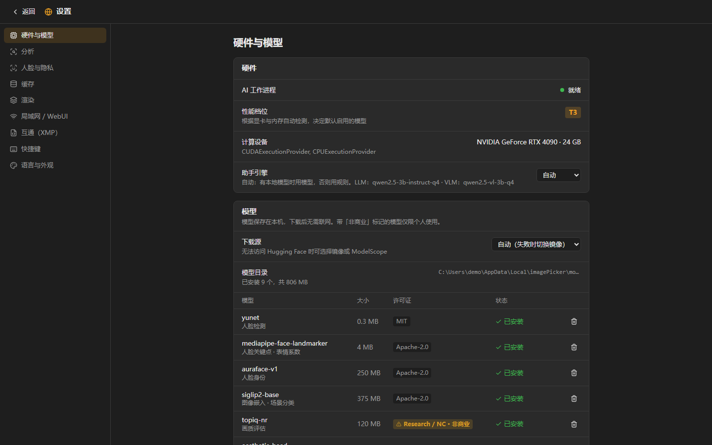

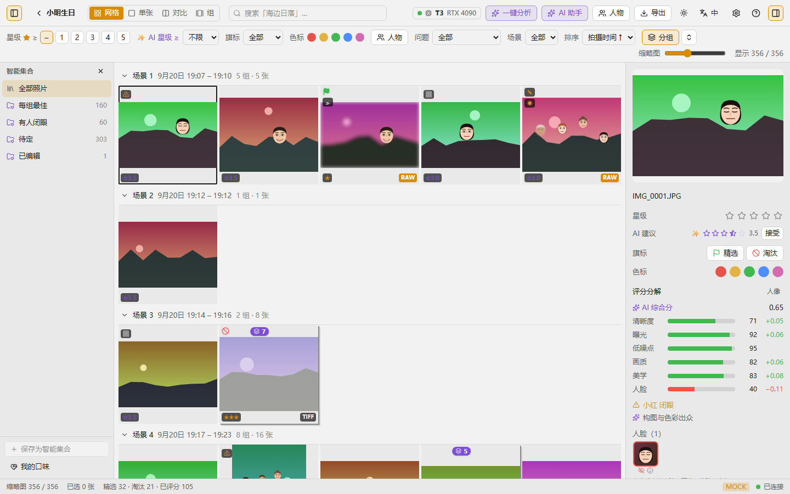

## 19. 故障排查与常见问题

| 现象 | 处理 |
|---|---|
| 「一键分析」提示 AI 引擎不可用 / 状态点为红色 | 在「设置 → 硬件与模型」安装（或重新安装）AI 组件；安装日志在数据目录 `logs/runtime-install.log`，工作进程日志也在 `logs/` |
| 有 NVIDIA 显卡却显示 T0 / 仅 CPU | 需要用 `--extra cuda` 安装（驱动 ≥ 580）；否则按 CPU 处理 |
| 模型下载失败 / 很慢 | 在「设置 → 硬件与模型 → 下载源」改用 HF 镜像或 ModelScope；检查「允许联网」是否被关闭 |
| 分析后星级「不准」 | 评分阈值尚未校准；把 AI 星级当建议，用「我的口味」让评分贴近你；严格度可在设置调整 |
| 连拍分组太松/太紧 | 「设置 → 分析 → 连拍分组严格度」，或在组视图手动「拆分 / 并入」 |
| HEIC 照片没有缩略图 | 没有可用的 HEIF 解码器（日志里写明缺什么）：Windows 从 Microsoft Store 安装「HEIF 图像扩展」+「HEVC 视频扩展」，或安装 AI 组件；Linux 安装 `libheif`（含 HEVC 插件，如 `libheif-plugin-libde265`）。装好后重启应用再浏览即补齐；只得到模糊小图的可在「设置 → 缓存」清除缩略图后重建 |
| 浏览器里无法拖入文件夹 | 浏览器模式不接收系统拖放，请用「选择文件夹」或使用桌面版 |
| 「此文件夹不在允许访问的目录中」 | 在「设置 → 局域网 → 允许访问的文件夹」添加该目录 |
| 局域网设备打不开 | 确认已开启局域网访问并设置所有者密码、防火墙放行端口（默认 7878）、两台设备在同一网络；更改端口后需重启 |
| 登录提示「尝试次数过多」 | 失败登录每分钟限 5 次，按提示等待 |
| 修图/生成任务超时 | 重试；CPU 档的超分、人脸修复很慢；可降低负载或换更高档位 |
| 缓存占用太大 | 「设置 → 缓存」逐类清除或降低上限；不会影响原图和编辑 |
| 想重置学习到的口味 | 「我的口味 → 重置我的口味」 |

**常见问题**

- **会修改或删除我的原图吗？** 不会。评分、旗标、编辑都在目录库；「淘汰」只是标记；导出写入你指定的新文件夹（开启 XMP 时只会写入 `.xmp` 侧车文件）。
- **一定要联网吗？** 只有下载模型时需要。下载完成后可完全离线。
- **没有显卡能用吗？** 能：快速档分析、基础编辑和挑片都可用；标准分析、超分等较慢。
- **支持哪些相机 RAW？** 常见品牌（见第 4 节）；RAW 用内嵌预览显示，编辑基于预览/解码结果。
- **Android 版？** 目前只有[设计文档](../08-Android版本设计.md)，尚未提供。
- **自然语言搜索？** 顶栏搜索框尚未启用；可先用 AI 助手的筛选指令。

更多已知问题见 [待办与已知问题](../backlog.md)。反馈问题请到 GitHub Issues，**请勿上传个人照片**。

## 20. 卸载

1. 用系统方式卸载应用（Windows：设置 → 应用；macOS：删除应用；Linux：删除 AppImage 或 `sudo apt remove` / `pacman -R`）。
2. 如需清除全部数据，再手动删除[数据目录](#数据位置)（含 `catalog.db`、缓存与模型）。**这会删除你的评分、编辑与人物数据**，请先备份需要的内容。你的原始照片位于你自己的文件夹中，不受影响。
3. 若开启过 XMP 侧车，照片旁的 `.xmp` 文件会保留（Lightroom / darktable 仍可使用），需要的话可自行删除。
